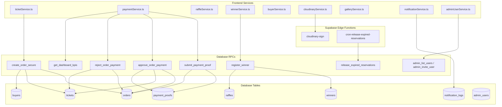

# AUDITORÍA 00: MAPA MAESTRO Y DESCUBRIMIENTO COMPLETO DEL SISTEMA
**PROYECTO:** RifaManaure (Nombre en código / package.json: `manaure-vive`)  
**REPOSITORIO:** `fran3004/RifaManaure`  
**ENTORNO LOCAL:** `c:\Users\frani\Downloads\RifaManaure`  
**FECHA DE AUDITORÍA:** 23 de Septiembre de 2026  
**ESTADO:** FASE DE AUDITORÍA ESTÁTICA EXCLUSIVA (CERO MODIFICACIONES DE CÓDIGO O BASE DE DATOS)  

---

## CONVENCIONES DE CLASIFICACIÓN UTILIZADAS

Toda afirmación, componente, flujo y entidad en este documento está clasificado bajo una de las siguientes etiquetas normativas:

* **`[VERIFICADO]`**: Confirmado de forma directa e inequívoca mediante inspección del código fuente local, configuraciones o scripts.
* **`[INFERIDO]`**: Deducción lógica y técnica basada en patrones y referencias del código, pero sujeta a confirmación en tiempo de ejecución.
* **`[NO VERIFICABLE]`**: Elemento que depende de infraestructura externa, secretos en la nube o estado vivo de la base de datos en Supabase a los cuales no se tiene acceso directo desde este entorno local.
* **`[CONTRADICTORIO]`**: Discrepancia real entre dos o más fuentes de verdad del proyecto (ej. migraciones vs. tipos TypeScript, o README vs. código).
* **`[HUÉRFANO]`**: Archivo, función, columna o recurso definido en el proyecto que no es invocado, consumido ni referenciado por ningún flujo activo.
* **`[OBSOLETO]`**: Código, documentación o definición que perteneció a una arquitectura anterior y fue reemplazado, pero permanece en el repositorio.
* **`[RIESGO]`**: Vulnerabilidad potencial de seguridad, punto único de fallo, inconsistencia de integridad referencial o conflicto de concurrencia.

---

# 1. RESUMEN EJECUTIVO

### 1.1 Naturaleza del Proyecto
`[VERIFICADO]` **Manaure Vive** es una plataforma web integral enfocada en la promoción turística de **Manaure Balcón del Cesar (Serranía del Perijá, Colombia)** combinada con un sistema de sorteos y recaudación mediante venta de boletos en línea (1.000 a 10.000 números). El sistema opera bajo un modelo de liquidación manual mediante transferencias bancarias nacionales (Bancolombia, Nequi, Daviplata, Llave Bre-B, Transfiya), con verificación humana de comprobantes en un panel administrativo protegido, emisión de certificados digitales para compradores y consulta pública con anonimización de datos sensibles en el motor SQL.

### 1.2 Stack Tecnológico Real
* **Frontend `[VERIFICADO]`**: React 19.2.8, React DOM 19.2.8, React Router DOM 7.18.4, Lucide React 1.46.0, tipografías auto-hospedadas `@fontsource-variable` (Outfit, Playfair Display, JetBrains Mono).
* **Herramientas de Construcción `[VERIFICADO]`**: Vite 8.3.0, TypeScript 6.0.2 (`strict: true`), Vitest 5.0.1, Oxlint 1.81.0, Prettier 3.9.7.
* **Backend como Servicio (BaaS) `[VERIFICADO]`**: Supabase (`@supabase/supabase-js` 2.116.0), conectado al proyecto de referencia `bxhzvmbbsisxqpwrgvgn`.
* **Motor de Base de Datos `[VERIFICADO]`**: PostgreSQL 15 con Row Level Security (RLS) mandatorio, funciones transaccionales con `SECURITY DEFINER`, aislamiento con `SET search_path = public, pg_temp`, bloqueos pesimistas `FOR UPDATE`, y triggers de validación de máquina de estados.
* **Infraestructura Serverless `[VERIFICADO]`**: Supabase Edge Functions sobre runtime Deno (2 funciones: `cloudinary-sign` y `cron-release-expired-reservations`).
* **Entrega de Medios y CDN `[VERIFICADO]`**: Cloudinary (Cloud Name `ky01b0vz`) para optimización y entrega dinámica de imágenes de marca, catálogo turístico, aliados y actas de sorteo; y Supabase Storage para almacenamiento privado de comprobantes de pago y galería.
* **Despliegue `[VERIFICADO]`**: Vercel con reglas de enrutamiento SPA (`vercel.json`), cabeceras CSP, mitigaciones anti-sniffing y caché inmutable de activos.

### 1.3 Estado General y Veredicto Técnico
El sistema demuestra una arquitectura de seguridad y concurrencia robusta en su núcleo transaccional (`create_order_secure`, `approve_order_payment`, `reject_order_payment`), con protección anti-enumeración de usuarios, enmascaramiento nativo de privacidad en PostgreSQL y serialización pesimista para prevenir venta duplicada. 

Sin embargo, la auditoría descubre:
1. **Desincronización en scripts de migración**: Existe un script monolítico `EJECUTAR_EN_SUPABASE_TODO_PENDIENTE.sql` que solo contiene las migraciones 001 a 025, dejando 11 migraciones críticas fuera (026 a 036).
2. **Conflicto de migración duplicada**: Dos migraciones comparten el prefijo `028_`.
3. **Bifurcación en el almacenamiento de archivos**: Coexisten buckets de Supabase Storage definidos en migraciones que han quedado deshabilitados o huérfanos porque los servicios frontend suben directamente a Cloudinary.
4. **Discrepancias en contratos de tipos**: Funciones SQL eliminadas en migración 023 continúan tipadas en TypeScript.
5. **Dependencias rotas de scripts**: Un script referenciado en `package.json` no existe físicamente en el repositorio.

---

# 2. ARQUITECTURA REAL

```
[ USUARIO PÚBLICO / COMPRADOR ]
       │
       ▼
[ FRONTEND SPA (React 19 + Vite 8) ]
   ├── HomePage.tsx / SelectorBoletos.tsx / ModalCheckout.tsx (7 pasos)
   ├── VerificarPage.tsx (Consulta pública con ofuscación)
   └── TerminosPage.tsx
       │
       ▼
[ SERVICIOS DE CLIENTE (@/services) ]
   ├── ticketService.ts (createOrder -> create_order_secure)
   ├── paymentService.ts (uploadPaymentProof -> submit_payment_proof)
   ├── notificationService.ts (wa.me + notification_logs)
   └── receiptGeneratorService.ts (Canvas 2D -> PNG/PDF)
       │
       ▼
[ SUPABASE CLIENT SINGLETON (@/lib/supabase.ts) ]
       │
       ├──► [ SUPABASE STORAGE ]
       │       └── Bucket privado 'payment-proofs' (Upload directo de comprobantes JPG/PNG/PDF)
       │
       ├──► [ SUPABASE EDGE FUNCTIONS ]
       │       ├── 'cloudinary-sign' (Firma HMAC SHA-1 para subida/borrado seguro)
       │       └── 'cron-release-expired-reservations' (Trigger externo para liberar reservas)
       │
       ▼
[ POSTGRESQL (Supabase Managed Engine) ]
   ├── RPCs SECURITY DEFINER (search_path = public, pg_temp)
   │     ├── create_order_secure() -> Bloqueo FOR UPDATE, upsert seguro de comprador, cálculo de monto
   │     ├── approve_order_payment() -> Orden 'paid', boletos 'sold', comprobante 'approved'
   │     ├── reject_order_payment() -> Orden 'rejected', boletos 'available', comprobante 'rejected'
   │     ├── verify_public_order_or_tickets() -> SELECT seguro con enmascarado SQL
   │     └── release_expired_reservations() -> Boletos vencidos a 'available'
   │
   ├── TRIGGERS DE MÁQUINA DE ESTADOS
   │     ├── trg_validate_order_status -> fn_validate_order_status_transition()
   │     └── trg_validate_ticket_status -> fn_validate_ticket_status_transition()
   │
   ├── ROW LEVEL SECURITY (RLS)
   │     ├── buyers: SELECT solo admins; INSERT restringido a admins (público vía RPC)
   │     ├── orders: SELECT solo admins; INSERT restringido a admins (público vía RPC)
   │     ├── tickets: SELECT público; UPDATE restringido a admin / RPCs
   │     └── payment_accounts: SELECT público de is_active = true
   │
   └── REALTIME (REPLICA IDENTITY FULL)
         └── Canales tickets, orders, raffles, winners, system_settings
               │
               ▼
[ PANEL ADMINISTRATIVO (@/pages/admin/views) ]
   ├── DashboardView.tsx (RPC get_dashboard_kpis)
   ├── ReceiptsView.tsx (getSignedProofUrl -> URLs firmadas temporales de 15 min)
   ├── OrdersView.tsx / TicketsView.tsx / BuyersView.tsx / RafflesView.tsx
   └── SettingsView.tsx / AuditView.tsx / WinnersView.tsx
```

---

# 3. INVENTARIO ABSOLUTAMENTE COMPLETO DE ARCHIVOS

### 3.1 Raíz del Proyecto
| Archivo | Tamaño (bytes) | Estado | Propósito Técnico Verificado |
| :--- | :--- | :--- | :--- |
| `.env` | ~250 | `[VERIFICADO]` `[RIESGO]` | Contiene credenciales activas del proyecto `bxhzvmbbsisxqpwrgvgn`. No versionado en Git. |
| `.env.example` | 3,365 | `[VERIFICADO]` | Plantilla con documentación exhaustiva de variables públicas y secretos de Edge Functions. |
| `.gitignore` | ~500 | `[VERIFICADO]` | Reglas de exclusión (ignora `.env`, `node_modules`, `dist`). |
| `.oxlintrc.json` | 694 | `[VERIFICADO]` | Configuración de Oxlint con plugins react, jsx-a11y, import, promise. |
| `.prettierrc` | 134 | `[VERIFICADO]` | Formato de código (comillas simples, ancho 100 caracteres). |
| `index.html` | 2,752 | `[VERIFICADO]` | Punto de entrada HTML con meta-tags SEO, preconexión de fuentes y viewport responsive. |
| `package.json` | 1,210 | `[VERIFICADO]` `[CONTRADICTORIO]` | Nombre `manaure-vive`. Declara script `"images:build": "node scripts/build-images.mjs"`. |
| `README.md` | 12,297 | `[VERIFICADO]` `[OBSOLETO]` | Documentación técnica general. Contiene discrepancias con el estado real del backend. |
| `tsconfig.json` | ~400 | `[VERIFICADO]` | Raíz de referencias TypeScript hacia `tsconfig.app.json` y `tsconfig.node.json`. |
| `tsconfig.app.json`| 600 | `[VERIFICADO]` | Configuración estricta del cliente web (`strict: true`, noUnusedLocals). |
| `tsconfig.node.json`| 400 | `[VERIFICADO]` | Configuración de entorno de soporte Node para scripts y Vite. |
| `vercel.json` | 1,438 | `[VERIFICADO]` | Reglas de SPA rewrites, Content Security Policy (CSP), protección contra clickjacking. |
| `vite.config.ts` | 1,044 | `[VERIFICADO]` | Configuración Vite, alias `@ -> /src`, split manual de vendors (`vendor-icons`, `vendor-react`, `vendor-supabase`). |
| `AUDITORIA_RESPONSIVE_COMPLETA.md` | 49,798 | `[VERIFICADO]` | Auditoría previa enfocada exclusivamente en diseño responsivo y adaptabilidad móvil. |

### 3.2 Directorio `public/`
| Archivo | Tamaño (bytes) | Estado | Propósito Técnico Verificado |
| :--- | :--- | :--- | :--- |
| `public/favicon.svg` | ~3,000 | `[VERIFICADO]` | Isotipo vectorial oficial del colibrí y montaña. |
| `public/favicon.ico` | ~15,000 | `[VERIFICADO]` | Favicon multiresolución para navegadores legados. |
| `public/favicon-16x16.png` | ~500 | `[VERIFICADO]` | Favicon estándar 16px. |
| `public/favicon-32x32.png` | ~1,000 | `[VERIFICADO]` | Favicon estándar 32px. |
| `public/apple-touch-icon.png` | ~10,000 | `[VERIFICADO]` | Icono para dispositivos iOS (180x180). |
| `public/pwa-192x192.png` | ~15,000 | `[VERIFICADO]` | Icono PWA para Android. |
| `public/pwa-512x512.png` | ~45,000 | `[VERIFICADO]` | Icono PWA alta resolución. |
| `public/pwa-maskable-512x512.png` | ~48,000 | `[VERIFICADO]` | Icono PWA con área de seguridad enmascarable. |
| `public/og-image.jpg` | ~120,000 | `[VERIFICADO]` | Banner OpenGraph oficial (1200x630) para compartir en redes sociales. |
| `public/og-image-v2.jpg` | ~115,000 | `[VERIFICADO]` `[HUÉRFANO]` | Variante alternativa de OpenGraph sin referencia activa en código. |
| `public/og-image-v2-branded.jpg` | ~130,000 | `[VERIFICADO]` `[HUÉRFANO]` | Variante alternativa con sello institucional sin uso activo. |
| `public/site.webmanifest` | 650 | `[VERIFICADO]` | Manifiesto PWA (`theme_color: #0d1f18`, `background_color: #08120e`). |
| `public/_headers` | ~300 | `[VERIFICADO]` | Cabeceras adicionales para servidores de hosting estático (Cloudflare Pages). |
| `public/images/rifa/image-manifest.json` | 105,586 | `[VERIFICADO]` | Manifiesto autogenerado de metadatos de las 18 imágenes en resoluciones múltiples. |
| `public/images/rifa/*` (subcarpetas) | ~8.5 MB | `[VERIFICADO]` | Variantes optimizadas en formatos duales WebP y JPG (640w, 1024w, 1600w, 1920w). |

### 3.3 Código Fuente `src/`
#### Raíz de `src/`
* `src/main.tsx` (1,863 bytes) `[VERIFICADO]`: Montaje de React 19 en `#root`, listener para errores de precarga (`vite:preloadError`) con auto-recuperación limitada a 15s.
* `src/App.tsx` (6,481 bytes) `[VERIFICADO]`: Enrutador declarativo con `BrowserRouter`, Providers (`AuthProvider`, `SystemSettingsProvider`), `ErrorBoundary`, `Suspense` y code splitting con `lazyWithRetry`.
* `src/database.types.ts` (249 bytes) `[VERIFICADO]` `[OBSOLETO]`: Archivo puente que re-exporta `src/types/database.types.ts`. Contiene un comentario desactualizado ("sincronizado con migraciones 001 a 027").
* `src/index.css` (106 bytes) `[VERIFICADO]`: Importación base de tokens de diseño y variables.

#### Subdirectorios de `src/`
* **`src/assets/`**:
  * `assets.ts` (13,386 bytes) `[VERIFICADO]`: Catálogo tipado de logotipos de marca en Cloudinary (`BRAND_LOGOS`) y datos estáticos de aliados.
  * `LEEME.md` (9,530 bytes) `[VERIFICADO]`: Documentación interna sobre la arquitectura de imágenes responsive y generación de derivados.
* **`src/config/`**:
  * `ticketSocialProof.ts` (2,097 bytes) `[VERIFICADO]`: Lógica pura de agregación de estadísticas de boletos (`calculateTicketStats`).
* **`src/context/`**:
  * `AdminRaffleContext.tsx` (3,688 bytes) `[VERIFICADO]`: Contexto y hook `useAdminRaffle` para selección y persistencia de rifa activa en panel admin.
  * `AuthContext.tsx` (4,486 bytes) `[VERIFICADO]`: Estado de sesión de Supabase Auth, verificación reactiva de `admin_users`.
  * `AuthContextDefinition.ts` (572 bytes) `[VERIFICADO]`: Definición de interfaz de contexto para desacoplar componentes.
  * `SystemSettingsContext.tsx` (2,549 bytes) `[VERIFICADO]`: Cache síncrona en `localStorage` y suscripción Realtime a `system_settings`.
  * `TicketCartContext.tsx` (12,412 bytes) `[VERIFICADO]`: Carrito de compras, selección aleatoria, suscripción Realtime a boletos y modal de checkout.
  * `TicketCartContextDefinition.ts` (1,069 bytes) `[VERIFICADO]`: Definición de interfaz del carrito de boletos.
  * `useAuth.ts` (286 bytes) `[VERIFICADO]`: Hook consumidor de `AuthContext`.
  * `useTicketCart.ts` (415 bytes) `[VERIFICADO]`: Hook consumidor de `TicketCartContext` con variante opcional segura (`useOptionalTicketCart`).
* **`src/data/`**:
  * `faqFallback.ts` (3,383 bytes) `[VERIFICADO]`: 6 preguntas frecuentes canónicas locales para contingencia si la tabla `faq_items` falla.
* **`src/hooks/`**:
  * `useActiveRaffle.ts` (7,065 bytes) `[VERIFICADO]`: Hook unificado de rifa activa, formateo de fechas en zona horaria Colombia, pad de dígitos y lotería.
  * `useDocumentTitle.ts` (378 bytes) `[VERIFICADO]`: Utilidad para actualización dinámica del tag `<title>`.
  * `useSystemSettings.ts` (377 bytes) `[VERIFICADO]`: Consumidor directo de `SystemSettingsContext`.
  * `useTicketStats.ts` (763 bytes) `[VERIFICADO]`: Cálculo memoizado de estadísticas de boletos vendidos, disponibles y reservados.
* **`src/lib/`**:
  * `lazyWithRetry.ts` (1,362 bytes) `[VERIFICADO]`: Envoltura de `React.lazy` con auto-recarga ante desajustes de hashes de chunks tras despliegues de producción.
  * `supabase.ts` (809 bytes) `[VERIFICADO]`: Cliente singleton de `@supabase/supabase-js` con `persistSession: true` y almacenamiento en `localStorage`.
  * `utils.ts` (4,358 bytes) `[VERIFICADO]`: Utilidades de formateo de moneda (`formatCOP`), números de boletos (`formatTicketNumber`), validaciones regex de cédula/teléfono/email y enmascaramiento de nombres.
* **`src/pages/`**:
  * `HomePage.tsx` (1,796 bytes) `[VERIFICADO]`: Landing page pública principal.
  * `AdminLoginPage.tsx` (5,435 bytes) `[VERIFICADO]`: Portal de acceso seguro para administradores.
  * `VerificarPage.tsx` (20,838 bytes) `[VERIFICADO]`: Consulta pública y segura de órdenes por referencia o documento mediante RPC `verify_public_order_or_tickets`.
  * `TerminosPage.tsx` (6,832 bytes) `[VERIFICADO]`: Términos y condiciones legales, política de tratamiento de datos personales (Habeas Data Ley 1581).
* **`src/pages/admin/views/`**:
  * 13 vistas administrativas correspondientes a cada área del sistema: `DashboardView.tsx`, `OrdersView.tsx`, `ReceiptsView.tsx`, `TicketsView.tsx`, `BuyersView.tsx`, `RafflesView.tsx`, `PrizeView.tsx`, `GalleryView.tsx`, `PaymentAccountsView.tsx`, `PartnersView.tsx`, `WinnersView.tsx`, `AuditView.tsx`, `SettingsView.tsx`.
* **`src/services/`**:
  * 16 módulos de servicio encargados de la comunicación con Supabase y Cloudinary (detallados en Sección 14).
* **`src/types/`**:
  * `database.types.ts` (28,165 bytes) `[VERIFICADO]`: Tipos generados de Supabase para las 17 tablas y 22 RPCs.
  * `image-manifest.ts` (101,396 bytes) `[VERIFICADO]`: Tipos y mapa exhaustivo de resoluciones de imágenes locales.
  * `raffle.types.ts` (5,288 bytes) `[VERIFICADO]`: Interfaces frontend, alias de tablas y modelos de vistas.
* **`src/test/`**:
  * 12 archivos de suite Vitest cubriendo utilidades, servicios de cloudinary, caché de preguntas, subida de premios y pruebas de modals.

---

# 4. INVENTARIO DE ENTIDADES Y TABLAS DE BASE DE DATOS

| Nombre de Tabla | Migración de Origen | Primary Key | Columnas Principales | Mecanismo RLS | Estado Verificado |
| :--- | :--- | :--- | :--- | :--- | :--- |
| **`raffles`** | 001, 020, 028 | `id UUID` | `title`, `slug`, `ticket_price`, `total_tickets`, `max_tickets_per_buyer`, `draw_date`, `lottery_reference`, `status` | SELECT público (`true`). Mutaciones restringidas a admins vía RPCs. | `[VERIFICADO]` |
| **`tickets`** | 001, 004, 010, 028 | `id UUID` | `raffle_id`, `number`, `status`, `buyer_id`, `order_id`, `reserved_at`, `reservation_expires_at` | SELECT público (`true`). Inserciones y updates solo vía RPCs autorizadas. | `[VERIFICADO]` |
| **`buyers`** | 001, 016, 019, 023 | `id UUID` | `full_name`, `document_id` (UNIQUE), `phone`, `email`, `city`, `created_at`, `updated_at` | SELECT exclusivo admins (`is_admin()`). INSERT/UPDATE delegado a RPC `create_order_secure`. | `[VERIFICADO]` |
| **`orders`** | 001, 003, 004, 008, 012, 013, 016, 023 | `id UUID` | `raffle_id`, `buyer_id`, `reference` (UNIQUE), `total_amount`, `ticket_count`, `status`, `payment_method`, `contact_preference`, `receipt_url` | SELECT exclusivo admins (`is_admin()`). INSERT/UPDATE bloqueado en cliente; creación exclusiva vía RPC `create_order_secure`. | `[VERIFICADO]` |
| **`partners`** | 001, 025 | `id UUID` | `slug` (UNIQUE), `name`, `category`, `description`, `logo_url`, `instagram_url`, `display_order`, `is_active` | SELECT público (`is_active = true`). ALL para administradores. | `[VERIFICADO]` |
| **`admin_users`** | 002, 017, 024 | `id UUID` | `user_id` (FK `auth.users`), `email` (UNIQUE), `full_name`, `role`, `is_active` | SELECT solo administradores activos (`is_admin()`). Mutaciones vía RPCs. | `[VERIFICADO]` |
| **`payment_accounts`** | 003, 005, 028 | `id UUID` | `bank_name`, `account_type`, `account_number`, `account_holder`, `holder_document_id`, `qr_code_url`, `display_order`, `is_active` | SELECT público (`is_active = true`). ALL para administradores. | `[VERIFICADO]` |
| **`audit_logs`** | 003, 004, 010, 016, 019, 020, 021, 022, 024 | `id UUID` | `action`, `entity_type`, `entity_id`, `performed_by`, `details` (JSONB), `created_at` | Append-only. SELECT exclusivo admins. UPDATE/DELETE denegado. | `[VERIFICADO]` |
| **`payment_proofs`** | 006, 015 | `id UUID` | `raffle_id`, `order_id`, `buyer_id`, `file_path`, `file_name`, `file_size`, `mime_type`, `status`, `verified_by` | SELECT admins y compradores propios. Inserción vía RPC `submit_payment_proof`. | `[VERIFICADO]` |
| **`notification_logs`** | 007, 009, 030 | `id UUID` | `order_id`, `event_type`, `channel`, `recipient`, `status`, `attempts`, `idempotency_key` (UNIQUE), `metadata` | SELECT/ALL admins. SELECT compradores de su propia orden. | `[VERIFICADO]` |
| **`winners`** | 021 | `id UUID` | `raffle_id`, `order_id`, `buyer_id`, `ticket_id`, `ticket_number`, `lottery_draw_number`, `draw_date`, `official_act_url`, `notes` | SELECT público (`true`). Mutaciones exclusivas admins vía `register_winner`. | `[VERIFICADO]` |
| **`system_settings`** | 022 | `id INT (CHECK id=1)` | `reservation_duration_minutes`, `max_tickets_per_buyer`, `support_whatsapp_number`, `support_email`, `updated_by` | SELECT público (`true`). Mutación exclusiva admins vía `admin_update_system_settings`. | `[VERIFICADO]` |
| **`prize_settings`** | 031, 033 | `id TEXT (CHECK id='main')` | `badge_text`, `title`, `subtitle`, `official_tour_badge`, `official_tour_title`, `official_tour_features` (JSONB) | SELECT público (`true`). ALL para administradores (`is_admin()`). | `[VERIFICADO]` |
| **`prize_experiences`** | 031, 033 | `id UUID` | `title`, `partner_name`, `description`, `features` (JSONB), `image_url`, `image_slug`, `icon`, `display_order`, `is_active` | SELECT público (`is_active = true` o admin). ALL para admins. | `[VERIFICADO]` |
| **`faq_items`** | 032, 034 | `id UUID` | `question`, `answer`, `sort_order`, `is_published`, `created_at`, `updated_at` | SELECT público (`is_published = true` o admin). ALL para admins. | `[VERIFICADO]` |
| **`gallery_items`** | 035 | `id UUID` | `raffle_id`, `title`, `category`, `image_slug`, `image_url`, `alt_text`, `display_order`, `is_active` | SELECT público (`is_active = true` o admin). ALL para admins. | `[VERIFICADO]` |
| **`gallery_categories`**| 036 | `id UUID` | `slug` (UNIQUE), `name`, `display_order`, `is_active` | SELECT público (`is_active = true` o admin). ALL para admins. | `[VERIFICADO]` |

---

# 5. INVENTARIO DE FUNCIONES RPC (REMOTE PROCEDURE CALLS)

| Nombre de la Función RPC | Migración de Definición Final | Seguridad y Aislamiento | Argumentos | Permisos GRANT | Propósito Verificado |
| :--- | :--- | :--- | :--- | :--- | :--- |
| **`is_admin`** | 029 | `SECURITY DEFINER`<br>`SET search_path = public, auth, pg_temp` | `p_user_id UUID DEFAULT NULL` | `anon`, `authenticated`, `service_role` | `[VERIFICADO]` Valida si el usuario activo (`auth.uid()`) es administrador activo. El parámetro es cosmético para evitar enumeración. |
| **`is_superadmin`** | 017 | `SECURITY DEFINER`<br>`SET search_path = public, pg_temp` | `p_user_id UUID` | `anon`, `authenticated`, `service_role` | `[VERIFICADO]` Valida si el usuario posee rol `superadmin` y está activo. |
| **`create_order_secure`** | 022 | `SECURITY DEFINER`<br>`SET search_path = public, pg_temp` | `p_raffle_id UUID`, `p_ticket_numbers TEXT[]`, `p_buyer_data JSONB`, `p_payment_method VARCHAR`, `p_contact_preference VARCHAR` | `anon`, `authenticated`, `service_role` | `[VERIFICADO]` Punto de entrada público mandatorio para compras. Ejecuta bloqueo `FOR UPDATE` de boletos, calcula monto en servidor y genera orden `pending`. |
| **`submit_payment_proof`** | 015, 028 | `SECURITY DEFINER`<br>`SET search_path = public, pg_temp` | `p_order_id UUID`, `p_file_path TEXT`, `p_file_name TEXT`, `p_file_size INT`, `p_mime_type VARCHAR`, `p_payment_reference TEXT` | `anon`, `authenticated`, `service_role` | `[VERIFICADO]` Valida que la ruta del archivo corresponda al `order_id`, inserta en `payment_proofs` y cambia orden a `pending_verification`. |
| **`approve_order_payment`** | 014, 023 | `SECURITY DEFINER`<br>`SET search_path = public, pg_temp` | `p_order_id UUID` | `authenticated`, `service_role` (REVOKE `anon`) | `[VERIFICADO]` Exclusivo admin (`is_admin()`). Bloqueo pesimista. Orden a `paid`, boletos a `sold`, comprobante a `approved`. |
| **`reject_order_payment`** | 014, 023 | `SECURITY DEFINER`<br>`SET search_path = public, pg_temp` | `p_order_id UUID`, `p_reason TEXT` | `authenticated`, `service_role` (REVOKE `anon`) | `[VERIFICADO]` Exclusivo admin (`is_admin()`). Orden a `rejected`, comprobante a `rejected` y boletos liberados a `available`. |
| **`release_expired_reservations`**| 011 | `SECURITY DEFINER`<br>`SET search_path = public, pg_temp` | *(ninguno)* | `anon`, `authenticated`, `service_role` | `[VERIFICADO]` Libera boletos con reserva vencida y transiciona órdenes `pending` a `expired`. Retorna cantidad de boletos liberados. |
| **`verify_public_order_or_tickets`**| 013 | `SECURITY DEFINER`<br>`SET search_path = public, pg_temp` | `p_search_term TEXT` | `anon`, `authenticated`, `service_role` | `[VERIFICADO]` Consulta pública segura por referencia o cédula. Realiza enmascarado estricto en SQL de nombres y documentos. |
| **`admin_block_ticket`** | 010, 023 | `SECURITY DEFINER`<br>`SET search_path = public, pg_temp` | `p_ticket_id UUID`, `p_reason TEXT` | `authenticated`, `service_role` (REVOKE `anon`) | `[VERIFICADO]` Bloquea preventivamente un boleto libre. Impide bloquear boletos ya vendidos con orden pagada. |
| **`admin_unblock_ticket`** | 010, 023 | `SECURITY DEFINER`<br>`SET search_path = public, pg_temp` | `p_ticket_id UUID`, `p_reason TEXT` | `authenticated`, `service_role` (REVOKE `anon`) | `[VERIFICADO]` Desbloquea un boleto en estado `blocked` devolviéndolo a `available`. |
| **`admin_update_buyer`** | 019, 023 | `SECURITY DEFINER`<br>`SET search_path = public, pg_temp` | `p_buyer_id UUID`, `p_full_name TEXT`, `p_phone TEXT`, `p_email TEXT`, `p_city TEXT` | `authenticated`, `service_role` (REVOKE `anon`) | `[VERIFICADO]` Actualización administrativa de datos de comprador con registro inmutable en `audit_logs`. |
| **`admin_create_raffle`** | 028 (flexible) | `SECURITY DEFINER`<br>`SET search_path = public, pg_temp` | `p_title TEXT`, `p_slug TEXT`, `p_description TEXT`, `p_ticket_price NUMERIC`, `p_total_tickets INT`, `p_max_tickets_per_buyer INT`, `p_draw_date TIMESTAMPTZ`, `p_lottery_reference TEXT`, `p_status TEXT` | `authenticated`, `service_role` | `[VERIFICADO]` Crea nueva edición de rifa y genera automáticamente todos sus boletos (`000` a `N`) con pad dinámico. |
| **`admin_update_raffle`** | 020, 023 | `SECURITY DEFINER`<br>`SET search_path = public, pg_temp` | `p_raffle_id UUID`, `p_title TEXT`, `p_description TEXT`, `p_ticket_price NUMERIC`, `p_draw_date TIMESTAMPTZ`, `p_lottery_reference TEXT`, `p_status TEXT`, `p_max_tickets_per_buyer INT` | `authenticated`, `service_role` | `[VERIFICADO]` Actualiza términos y fechas de rifa. Si se activa, pausa automáticamente las demás rifas activas. |
| **`register_winner`** | 021, 023 | `SECURITY DEFINER`<br>`SET search_path = public, pg_temp` | `p_raffle_id UUID`, `p_ticket_number TEXT`, `p_lottery_draw_number TEXT`, `p_draw_date TIMESTAMPTZ`, `p_official_act_url TEXT`, `p_delivery_photos TEXT[]`, `p_notes TEXT` | `authenticated`, `service_role` | `[VERIFICADO]` Valida que el boleto esté efectivamente vendido (`sold`), asocia ganador en `winners`, marca rifa como `finished` y audita. |
| **`admin_update_system_settings`**| 022, 023 | `SECURITY DEFINER`<br>`SET search_path = public, pg_temp` | `p_reservation_duration_minutes INT`, `p_max_tickets_per_buyer INT`, `p_support_whatsapp_number TEXT`, `p_support_email TEXT` | `authenticated`, `service_role` | `[VERIFICADO]` Modifica la fila única de parámetros en `system_settings` (id = 1). |
| **`admin_list_users`** | 024 | `SECURITY DEFINER`<br>`SET search_path = public, auth, pg_temp` | *(ninguno)* | `authenticated`, `service_role` (REVOKE `anon`) | `[VERIFICADO]` Lista todos los administradores uniendo con `auth.users` para conocer última fecha de inicio de sesión. |
| **`admin_invite_user`** | 024 | `SECURITY DEFINER`<br>`SET search_path = public, auth, pg_temp` | `p_email TEXT`, `p_role TEXT`, `p_full_name TEXT` | `authenticated`, `service_role` (REVOKE `anon`) | `[VERIFICADO]` Pre-autoriza una cuenta de administrador. Solo un superadmin puede designar a otro superadmin. |
| **`admin_toggle_user_status`**| 024 | `SECURITY DEFINER`<br>`SET search_path = public, auth, pg_temp` | `p_admin_user_id UUID`, `p_is_active BOOLEAN` | `authenticated`, `service_role` (REVOKE `anon`) | `[VERIFICADO]` Activa/desactiva administradores. Prohíbe autodesactivación y prohíbe desactivar al último superadmin activo. |
| **`get_dashboard_kpis`** | 027 | `SECURITY DEFINER`<br>`SET search_path = public, pg_catalog, pg_temp` | `p_raffle_id UUID DEFAULT NULL` | `authenticated`, `service_role` (REVOKE `anon`) | `[VERIFICADO]` Métricas agregadas (COUNT, SUM, FILTER) en $O(1)$ viaje de red para el Dashboard administrativo. |
| **`cancel_order`** | 004, 023 | `SECURITY DEFINER`<br>`SET search_path = public, pg_temp` | `p_order_id UUID`, `p_reason TEXT` | `authenticated`, `service_role` | `[VERIFICADO]` Cancela una orden `pending` y libera sus boletos a `available`. |
| **`reserve_tickets`** | 022 | `SECURITY DEFINER`<br>`SET search_path = public, pg_temp` | `p_raffle_id UUID`, `p_ticket_numbers TEXT[]`, `p_buyer_id UUID`, `p_duration_minutes INT` | `anon`, `authenticated`, `service_role` | `[VERIFICADO]` `[HUÉRFANO]` Reserva clásica de boletos. No se utiliza en el flujo de checkout actual (reemplazada por `create_order_secure`). |
| **`submit_order_receipt`** | 003 | *ELIMINADA* en migración 023 | — | — | `[OBSOLETO]` `[CONTRADICTORIO]` Droppeada formalmente en SQL, pero sigue declarada en `database.types.ts`. |
| **`confirm_order_payment`**| 003 | *ELIMINADA* en migración 023 | — | — | `[OBSOLETO]` `[CONTRADICTORIO]` Droppeada formalmente en SQL, pero sigue declarada en `database.types.ts`. |

---

# 6. INVENTARIO DE EDGE FUNCTIONS (RUNTIME DENO)

### 6.1 `cloudinary-sign` (`supabase/functions/cloudinary-sign/index.ts`)
* **Propósito `[VERIFICADO]`**: Generación segura en servidor de firmas criptográficas HMAC-SHA1 para subida y eliminación de activos en Cloudinary sin exponer jamás el `CLOUDINARY_API_SECRET` al navegador.
* **Método y Rutas `[VERIFICADO]`**: Solo admite peticiones `POST` (con soporte CORS completo preflight `OPTIONS`).
* **Seguridad y Autorización `[VERIFICADO]`**:
  * Requiere cabecera `Authorization: Bearer <JWT>`.
  * Valida la identidad del usuario mediante `supabaseClient.auth.getUser(token)`.
  * Ejecuta la RPC `is_admin` para verificar que el usuario tenga privilegios administrativos activos (con fallback a consulta directa en `admin_users` mediante `service_role_key`).
* **Acciones Implementadas `[VERIFICADO]`**:
  1. `action: "upload"`: Exige parámetro `folder`. Construye string canónica `folder=<folder>&timestamp=<timestamp><api_secret>` y calcula hash SHA-1 hexadecimal mediante Web Crypto API.
  2. `action: "destroy"`: Exige parámetro `public_id`. Construye string canónica `public_id=<public_id>&timestamp=<timestamp><api_secret>` y calcula hash SHA-1 hexadecimal.
* **Orígenes CORS Permitidos `[VERIFICADO]`**:
  * `https://rifa-manaure.vercel.app`
  * `https://manaurevive.com`
  * `https://www.manaurevive.com`
  * Dominios locales (`localhost`, `127.0.0.1`)
  * Cualquier subdominio de Vercel (`*.vercel.app`)

### 6.2 `cron-release-expired-reservations` (`supabase/functions/cron-release-expired-reservations/index.ts`)
* **Propósito `[VERIFICADO]`**: Tarea programada o endpoint webhook para ejecutar de forma periódica la función SQL `public.release_expired_reservations()`.
* **Método y Rutas `[VERIFICADO]`**: Admite `GET` o `POST` (con soporte CORS preflight `OPTIONS`).
* **Seguridad y Autorización `[VERIFICADO]`**:
  * Valida token Bearer contra el secreto de servidor `CRON_SECRET` o contra `SUPABASE_SERVICE_ROLE_KEY`.
* **Conexión a Base de Datos `[VERIFICADO]`**:
  * Inicializa cliente de Supabase con `SUPABASE_SERVICE_ROLE_KEY` para ejecutar `supabase.rpc('release_expired_reservations')`.
  * Retorna payload JSON con `{ success: true, released_tickets_count: number }`.

---

# 7. INVENTARIO DE TRIGGERS DE BASE DE DATOS

| Nombre del Trigger | Tabla Afectada | Evento de Disparo | Función Ejecutada | Propósito Verificado |
| :--- | :--- | :--- | :--- | :--- |
| **`trg_validate_order_status`** | `orders` | `BEFORE UPDATE OF status` | `fn_validate_order_status_transition()` | `[VERIFICADO]` Valida que la transición entre estados de la orden sea matemáticamente válida en la máquina de estados. |
| **`trg_validate_ticket_status`**| `tickets` | `BEFORE UPDATE OF status` | `fn_validate_ticket_status_transition()` | `[VERIFICADO]` Protege la integridad de boletos. Impide que un boleto pase a `sold` sin orden en estado `paid`/`completed`. |
| **`trg_payment_accounts_updated_at`** | `payment_accounts` | `BEFORE UPDATE` | `fn_payment_accounts_updated_at()` | `[VERIFICADO]` Actualiza el campo `updated_at = NOW()`. |
| **`trg_audit_payment_accounts`** | `payment_accounts` | `AFTER INSERT OR UPDATE OR DELETE` | `fn_audit_payment_accounts()` | `[VERIFICADO]` Registra cualquier alteración en cuentas bancarias dentro de `audit_logs` con valores anteriores y nuevos. |
| **`trg_payment_proofs_updated_at`** | `payment_proofs` | `BEFORE UPDATE` | `fn_payment_proofs_updated_at()` | `[VERIFICADO]` Actualiza el campo `updated_at = NOW()`. |
| **`on_auth_user_created_sync_admin`** | `auth.users` | `AFTER INSERT OR UPDATE OF email` | `sync_admin_user_id()` | `[VERIFICADO]` Sincroniza automáticamente el UUID de `auth.users` en `admin_users.user_id` cuando un usuario registrado coincide por email. |
| **`trg_partners_updated_at`** | `partners` | `BEFORE UPDATE` | `fn_partners_updated_at()` | `[VERIFICADO]` Actualiza el campo `updated_at = NOW()`. |
| **`trg_prize_settings_updated_at`** | `prize_settings` | `BEFORE UPDATE` | `fn_prize_updated_at()` | `[VERIFICADO]` Actualiza el campo `updated_at = NOW()`. |
| **`trg_prize_experiences_updated_at`** | `prize_experiences` | `BEFORE UPDATE` | `fn_prize_updated_at()` | `[VERIFICADO]` Actualiza el campo `updated_at = NOW()`. |
| **`trg_faq_items_updated_at`** | `faq_items` | `BEFORE UPDATE` | `fn_faq_items_updated_at()` | `[VERIFICADO]` Actualiza el campo `updated_at = now()`. |
| **`trg_gallery_items_updated_at`** | `gallery_items` | `BEFORE UPDATE` | `fn_prize_updated_at()` | `[VERIFICADO]` Actualiza el campo `updated_at = NOW()`. |
| **`trg_gallery_categories_updated_at`** | `gallery_categories`| `BEFORE UPDATE` | `fn_prize_updated_at()` | `[VERIFICADO]` Actualiza el campo `updated_at = NOW()`. |

---

# 8. INVENTARIO DE POLÍTICAS DE SEGURIDAD (ROW LEVEL SECURITY - RLS)

Todas las 17 tablas del esquema tienen `ALTER TABLE ... ENABLE ROW LEVEL SECURITY;` `[VERIFICADO]`.

### 8.1 Políticas en Tablas de Negocio
* **`raffles`**:
  * `"Lectura pública de rifas"`: `FOR SELECT TO public USING (true);`
  * Mutaciones directas denegadas a clientes: se ejecutan mediante RPCs `admin_create_raffle` y `admin_update_raffle` con `SECURITY DEFINER`.
* **`tickets`**:
  * `"Lectura pública de tickets"`: `FOR SELECT TO public USING (true);`
  * Mutaciones directas bloqueadas a anónimos: la reserva, venta y bloqueo se gestionan exclusivamente mediante las RPCs seguras.
* **`buyers`**:
  * `"Lectura de compradores para administradores"` (019): `FOR SELECT TO authenticated USING (public.is_admin(auth.uid()));`
  * Inserción pública directa eliminada (023): compras gestionadas vía `create_order_secure`.
* **`orders`**:
  * `"Lectura de órdenes solo para administradores"` (013): `FOR SELECT TO authenticated USING (public.is_admin(auth.uid()));`
  * Inserción pública directa eliminada (023): compras gestionadas vía `create_order_secure`.
  * Verificación pública para clientes: mediante RPC `verify_public_order_or_tickets(p_search_term)`.
* **`partners`**:
  * `"Lectura pública de aliados"` (025): `FOR SELECT USING (is_active = true);`
  * `"Administradores pueden gestionar aliados"` (025): `FOR ALL TO authenticated USING (public.is_admin(auth.uid())) WITH CHECK (public.is_admin(auth.uid()));`
* **`admin_users`**:
  * `"Lectura de usuarios administrativos para administradores activos"` (017): `FOR SELECT TO authenticated USING (public.is_admin());`
  * Mutaciones directas bloqueadas: controladas vía RPCs `admin_invite_user` y `admin_toggle_user_status`.
* **`payment_accounts`**:
  * `"Lectura pública de cuentas de pago activas"` (028a): `FOR SELECT TO anon, authenticated USING (is_active = true);`
  * `"Administradores pueden gestionar cuentas de pago"` (028a): `FOR ALL TO authenticated USING (public.is_admin((SELECT auth.uid()))) WITH CHECK (public.is_admin((SELECT auth.uid())));`
* **`audit_logs`**:
  * `"Lectura de auditoría solo para administradores"`: `FOR SELECT TO authenticated USING (public.is_admin(auth.uid()));`
  * INSERT permitido a funciones `SECURITY DEFINER`. No hay políticas de UPDATE ni DELETE (tabla inmutable).
* **`payment_proofs`**:
  * `"Administradores pueden ver todos los comprobantes"`: `FOR SELECT TO authenticated USING (public.is_admin(auth.uid()));`
  * Inserción controlada vía RPC `submit_payment_proof`.
* **`notification_logs`**:
  * `"Admins pueden gestionar todos los logs de notificaciones"` (009): `FOR ALL TO authenticated USING (public.is_admin()) WITH CHECK (public.is_admin());`
  * `"Compradores pueden ver logs de sus órdenes"` (009): `FOR SELECT TO authenticated USING (EXISTS (SELECT 1 FROM orders JOIN buyers ...));`
* **`winners`**:
  * `"Lectura pública de ganadores"` (021): `FOR SELECT TO public USING (true);`
  * `"Administradores pueden gestionar ganadores"` (021): `FOR ALL TO authenticated USING (public.is_admin(auth.uid())) WITH CHECK (public.is_admin(auth.uid()));`
* **`system_settings`**:
  * `"Lectura pública de configuraciones operativas"` (022): `FOR SELECT TO public USING (true);`
  * `"Administradores pueden gestionar configuraciones operativas"` (022): `FOR ALL TO authenticated USING (public.is_admin(auth.uid())) WITH CHECK (public.is_admin(auth.uid()));`
* **`prize_settings`**:
  * `"Lectura pública de prize_settings"` (031): `FOR SELECT USING (true);`
  * `"Administradores gestionan prize_settings"` (031): `FOR ALL TO authenticated USING (public.is_admin(auth.uid())) WITH CHECK (public.is_admin(auth.uid()));`
* **`prize_experiences`**:
  * `"Lectura pública de experiencias activas"` (031): `FOR SELECT USING (is_active = true OR (auth.role() = 'authenticated' AND public.is_admin(auth.uid())));`
  * `"Administradores gestionan prize_experiences"` (031): `FOR ALL TO authenticated USING (public.is_admin(auth.uid())) WITH CHECK (public.is_admin(auth.uid()));`
* **`faq_items`**:
  * `"faq_items_public_read"` (034): `FOR SELECT TO anon, authenticated USING (is_published = true OR (auth.role() = 'authenticated' AND public.is_admin(auth.uid())));`
  * `"Administradores gestionan faq_items"` (034): `FOR ALL TO authenticated USING (public.is_admin(auth.uid())) WITH CHECK (public.is_admin(auth.uid()));`
* **`gallery_items`**:
  * `"gallery_items_public_read"` (035): `FOR SELECT USING (is_active = true OR (auth.role() = 'authenticated' AND public.is_admin(auth.uid())));`
  * `"gallery_items_admin_manage"` (035): `FOR ALL TO authenticated USING (public.is_admin(auth.uid())) WITH CHECK (public.is_admin(auth.uid()));`
* **`gallery_categories`**:
  * `"gallery_categories_public_read"` (036): `FOR SELECT USING (is_active = true OR (auth.role() = 'authenticated' AND public.is_admin(auth.uid())));`
  * `"gallery_categories_admin_manage"` (036): `FOR ALL TO authenticated USING (public.is_admin(auth.uid())) WITH CHECK (public.is_admin(auth.uid()));`

### 8.2 Políticas sobre `storage.objects`
1. **`payment-proofs` `[VERIFICADO]`**:
   * INSERT: `"Compradores pueden subir comprobantes a payment-proofs"` (015). Valida que el nombre del archivo contenga un `order_id` existente y que dicha orden se encuentre en estado `pending` o `pending_verification`.
   * SELECT: `"Solo administradores pueden ver comprobantes"` (006). Restringido a `public.is_admin(auth.uid())`. El comprador nunca tiene acceso de lectura directo al bucket; solo el admin genera URLs firmadas temporales (`createSignedUrl`).
2. **`gallery-images` `[VERIFICADO]`**:
   * SELECT: `"Lectura pública de fotos de galería"` (035). Acceso público a cualquier objeto en el bucket.
   * INSERT / UPDATE / DELETE: `"Solo administradores ... fotos de galería"` (035). Restringido a `public.is_admin(auth.uid())`.
3. **`winner-documents` `[VERIFICADO]`**:
   * SELECT: `"Lectura pública de documentos de ganadores"` (021).
   * INSERT / UPDATE / DELETE: Solo administradores (`public.is_admin(auth.uid())`).
4. **`partner-logos` `[VERIFICADO]`**:
   * SELECT: `"Lectura pública de logos de aliados"` (025).
   * INSERT / UPDATE / DELETE: Solo administradores (`public.is_admin(auth.uid())`).
5. **`prize-images` `[VERIFICADO]`**:
   * SELECT: `"Lectura pública de imágenes de premios"` (031).
   * INSERT / UPDATE / DELETE: Solo administradores (`public.is_admin(auth.uid())`).

---

# 9. INVENTARIO DE STORAGE (BUCKETS Y PROVEEDORES)

| Identificador Bucket | Proveedor de Almacenamiento | Visibilidad | Límite por Archivo | Tipos MIME Admitidos | Estado de Uso en Frontend |
| :--- | :--- | :--- | :--- | :--- | :--- |
| **`payment-proofs`** | Supabase Storage | **Privado** | 5 MB | `image/jpeg`, `image/png`, `image/webp`, `application/pdf` | `[VERIFICADO]` **Activo**. Consumido por `paymentService.ts` (`uploadPaymentProof`, `getSignedProofUrl`). |
| **`gallery-images`** | Supabase Storage | **Público** | 10 MB | `image/jpeg`, `image/png`, `image/webp`, `image/avif`, `image/svg+xml` | `[VERIFICADO]` **Activo**. Consumido por `galleryService.ts` (`uploadGalleryPhoto`). |
| **`receipts`** | Supabase Storage | Privado | 5 MB | Imágenes y PDFs | `[OBSOLETO]` Reemplazado por `payment-proofs`. `paymentService.ts` mantiene un fallback de lectura firmado de contingencia. |
| **`partner-logos`** | Supabase Storage | Público | 5 MB | Imágenes y SVG | `[HUÉRFANO]` Creado en migración 025. El frontend `partnerService.ts` sube los logos a Cloudinary (`manaure-vive/aliados`). |
| **`prize-images`** | Supabase Storage | Público | 5 MB | Imágenes y SVG | `[HUÉRFANO]` Creado en migración 031. El frontend `prizeService.ts` sube imágenes a Cloudinary (`manaure-vive/premios`). |
| **`winner-documents`**| Supabase Storage | Público | 10 MB | PDFs e imágenes | `[HUÉRFANO]` Creado en migración 021. El frontend `winnerService.ts` sube actas a Cloudinary (`manaure-vive/actas-ganadores`). |
| **Cloudinary** (`ky01b0vz`) | Cloudinary CDN | Público / CDN | Sin límite estricto local | Imágenes y documentos | `[VERIFICADO]` **Activo**. Usado para marca oficial, aliados, premios y actas oficiales mediante `cloudinaryService.ts`. |

---

# 10. INVENTARIO DE REALTIME (SUPABASE REALTIME)

### 10.1 Configuración de Replicación en PostgreSQL `[VERIFICADO]`
Mediante las migraciones 018 y 028a se configuró `REPLICA IDENTITY FULL` sobre las siguientes tablas:
* `public.tickets`
* `public.orders`
* `public.raffles`
* `public.system_settings`
* `public.winners`
* `public.payment_accounts`
* `public.partners`

> `[RIESGO]` La adición de las tablas a la publicación `supabase_realtime` requiere ser ejecutada en el panel de Supabase o mediante `ALTER PUBLICATION supabase_realtime ADD TABLE ...;` (documentado en migración 018).

### 10.2 Canales y Eventos Escuchados en el Frontend `[VERIFICADO]`
1. **Canal `raffles_realtime_channel`** (`TicketCartContext.tsx` y `AdminRaffleContext.tsx`):
   * Escucha: `postgres_changes`, `event: '*'`, `table: 'raffles'`.
   * Acción: Recarga automática de rifa activa, pausa instantánea de ventas si se modifica el estado.
2. **Canal `winners_realtime_channel`** (`TicketCartContext.tsx`):
   * Escucha: `postgres_changes`, `event: '*'`, `table: 'winners'`.
   * Acción: Conmuta la vista pública al showcase del ganador inmediatamente al registrarse el sorteo.
3. **Canal `tickets_realtime_${raffle.id}`** (`TicketCartContext.tsx`):
   * Escucha: `postgres_changes`, `event: '*'`, `table: 'tickets'`, con filtro `raffle_id=eq.${raffle.id}`.
   * Acción: Actualiza la grilla de boletos en tiempo real. Si un boleto seleccionado por el usuario es comprado o reservado por otro comprador, lo deselecciona automáticamente.
4. **Canal `system_settings_global_channel`** (`SystemSettingsContext.tsx`):
   * Escucha: `postgres_changes`, `event: '*'`, `table: 'system_settings'`.
   * Acción: Actualiza duración de reserva y tope de boletos sin requerir recarga de página.
5. **Canal `admin_raffles_realtime_channel`** (`AdminRaffleContext.tsx`):
   * Escucha cambios en rifas para actualizar métricas de panel administrativo.

---

# 11. INVENTARIO DE CRON / TRABAJOS PROGRAMADOS

| Mecanismo de Programación | Configuración | Función Invocada | Entorno de Ejecución | Estado Técnico |
| :--- | :--- | :--- | :--- | :--- |
| **`pg_cron` en PostgreSQL** | `*/5 * * * *` (Cada 5 minutos) | `SELECT public.release_expired_reservations();` | Extensión `pg_cron` en Supabase | `[INFERIDO]` `[NO VERIFICABLE]` Definido en migración 011. Requiere que la extensión `pg_cron` esté habilitada en el Dashboard de Supabase. |
| **Edge Function Externa** | Invocación HTTP Bearer | `release_expired_reservations()` vía Supabase client con `service_role` | Supabase Edge Function `cron-release-expired-reservations` | `[VERIFICADO]` Código presente en repositorio. Puede ejecutarse vía Vercel Cron, GitHub Actions o curl externo con `CRON_SECRET`. |
| **Ejecución Preventiva en Vuelo** | En cada llamada a `create_order_secure` y `reserve_tickets` | `PERFORM public.release_expired_reservations();` | Procedimiento almacenado PostgreSQL | `[VERIFICADO]` Se ejecuta de manera determinista antes de comprobar disponibilidad de boletos, garantizando que un boleto expirado quede libre inmediatamente para una nueva compra. |

---

# 12. INVENTARIO DE ESTADOS Y MÁQUINAS DE ESTADOS

### 12.1 Máquina de Estados: `orders.status` `[VERIFICADO]`
Protegida a nivel de base de datos por el trigger `trg_validate_order_status` (`fn_validate_order_status_transition`).

* **Valores Permitidos**: `'pending'`, `'pending_verification'`, `'paid'`, `'completed'`, `'rejected'`, `'expired'`, `'cancelled'`, `'refunded'`.
* **Estado Inicial**: `'pending'` (asignado por `create_order_secure`).
* **Matriz de Transiciones Válidas**:
  * `pending` ➔ `pending_verification` (al invocar `submit_payment_proof`).
  * `pending` ➔ `expired` (al invocar `release_expired_reservations`).
  * `pending` ➔ `cancelled` (al invocar `cancel_order`).
  * `pending_verification` ➔ `paid` (al invocar `approve_order_payment`).
  * `pending_verification` ➔ `rejected` (al invocar `reject_order_payment`).
  * `paid` ➔ `completed` (transición de compatibilidad histórica).
  * `paid` ➔ `refunded` (transición permitida para auditoría).
* **Transiciones Inválidas Bloqueadas por Trigger**:
  * Un estado terminal (`paid`, `rejected`, `expired`, `cancelled`) **no puede** regresar a `pending` ni a `pending_verification`.
  * Una orden `paid` **no puede** ser rechazada arbitrariamente.

```
                  ┌──────────────┐
                  │   pending    │
                  └──────┬───────┘
          ┌──────────────┼──────────────┐
          ▼              ▼              ▼
   ┌─────────────┐ ┌───────────┐ ┌─────────────┐
   │   expired   │ │ cancelled │ │ pending_    │
   └─────────────┘ └───────────┘ │ verification│
                                 └──────┬──────┘
                         ┌──────────────┴──────────────┐
                         ▼                             ▼
                  ┌──────────────┐              ┌──────────────┐
                  │     paid     │              │   rejected   │
                  └──────┬───────┘              └──────────────┘
                         ▼
                  ┌──────────────┐
                  │  completed   │
                  └──────────────┘
```

### 12.2 Máquina de Estados: `tickets.status` `[VERIFICADO]`
Protegida por el trigger `trg_validate_ticket_status` (`fn_validate_ticket_status_transition`).

* **Valores Permitidos**: `'available'`, `'reserved'`, `'sold'`, `'blocked'`.
* **Estado Inicial**: `'available'` (creado por `admin_create_raffle`).
* **Matriz de Transiciones Válidas**:
  * `available` ➔ `reserved` (por `create_order_secure` o `reserve_tickets`).
  * `reserved` ➔ `available` (por expiración de reserva o rechazo/cancelación de orden).
  * `reserved` ➔ `sold` (**estrictamente condicionado** a que la orden asociada esté en `paid` o `completed`).
  * `available` ➔ `blocked` (por `admin_block_ticket`).
  * `blocked` ➔ `available` (por `admin_unblock_ticket`).
* **Transiciones Inválidas Bloqueadas por Trigger**:
  * Un boleto `sold` **no puede** pasar a `available` ni a `blocked` sin invalidación previa explícita.
  * Un boleto no puede pasar a `sold` directamente desde `available` sin orden previa.

### 12.3 Máquina de Estados: `raffles.status` `[VERIFICADO]`
* **Valores Permitidos**: `'draft'`, `'active'`, `'paused'`, `'closed'`, `'finished'`.
* **Regla de Negocio Exclusiva**: Al actualizar una rifa a `'active'`, el procedimiento `admin_update_raffle` o `admin_create_raffle` actualiza automáticamente a `'paused'` cualquier otra rifa activa existente en el sistema.
* **Transición a Finished**: Ocurre automáticamente en la RPC `register_winner`.

### 12.4 Máquina de Estados: `payment_proofs.status` `[VERIFICADO]`
* **Valores Permitidos**: `'pending'`, `'approved'`, `'rejected'`.
* **Transición**: Se sincroniza atómicamente con la orden dentro de `approve_order_payment` y `reject_order_payment`.

### 12.5 Tipos y Roles Operativos `[VERIFICADO]`
* **`admin_users.role`**: `'superadmin'` (gestión total y creación de admins), `'admin'` (gestión operativa de compras y boletos), `'auditor'` (solo lectura de bitácora y métricas).
* **`orders.contact_preference`**: `'whatsapp'`, `'email'`, `'both'`.
* **`orders.payment_method`**: `'transfer_manual'`, `'wompi'`, `'bold'`, `'mercadopago'`, `'cash'` (solo `transfer_manual` opera activamente en frontend).

---

# 13. INVENTARIO DE FLUJOS DEL SISTEMA

### Flujo 1: Compra Pública y Reserva de Boletos
1. **Frontend**: El comprador interactúa con `SelectorBoletos.tsx`, selecciona números (o usa selección aleatoria en `TicketCartContext`).
2. **Apertura de Checkout**: Se despliega `ModalCheckout.tsx` (Paso 1: Datos del Comprador).
3. **Paso 3 a 4**: Se invoca `ticketService.createOrder(...)`.
4. **RPC Backend**: Se ejecuta `create_order_secure`:
   * Verifica rifa activa y límite de boletos por comprador.
   * Ejecuta `release_expired_reservations()` preventivo.
   * Bloquea los boletos solicitados con `FOR UPDATE`.
   * Calcula el total exclusivamente en el servidor (`ticket_price * ticket_count`).
   * Realiza `INSERT ... ON CONFLICT (document_id) DO NOTHING` en `buyers` para preservar datos si ya existía.
   * Inserta en `orders` con estado `'pending'` y referencia única `MV-XXXXXXXX`.
   * Actualiza boletos a estado `'reserved'` con `reservation_expires_at = NOW() + INTERVAL '10 minutes'`.
   * Inserta evento `'ORDER_CREATED_SECURE'` en `audit_logs`.
5. **Paso 4**: El usuario visualiza cuentas bancarias activas desde `getPaymentAccounts()`.

### Flujo 2: Envío de Comprobante de Pago
1. **Paso 6 Checkout**: El comprador carga imagen o PDF de su transferencia.
2. **Frontend Validation**: `validateProofFile(file)` valida tamaño (< 5 MB) y extensión (JPG, PNG, WEBP, PDF).
3. **Upload Storage**: `paymentService.uploadPaymentProof` sube el archivo al bucket privado `payment-proofs` en la ruta `proofs/{raffleId}/{orderId}/{cleanFileName}`.
4. **RPC Backend**: Se invoca `submit_payment_proof`:
   * Bloquea la orden con `FOR UPDATE`.
   * Valida correspondencia estricta de ruta vs `order_id`.
   * Inserta registro en `payment_proofs` con estado `'pending'`.
   * Actualiza orden a `'pending_verification'`.
   * Audita `'PAYMENT_PROOF_SUBMITTED'` en `audit_logs`.
5. **Notificación**: Se genera el mensaje de confirmación para WhatsApp (`buildReceiptReceivedMessage`) y se registra en `notification_logs`.

### Flujo 3: Aprobación Administrativa de Pago
1. **Admin Panel**: El administrador autorizado ingresa a `ReceiptsView.tsx` o `OrdersView.tsx` y abre `AdminOrderReviewModal.tsx`.
2. **Acceso Seguro**: `getSignedProofUrl` genera una URL firmada de 15 minutos en Supabase Storage para previsualizar el comprobante privado.
3. **Confirmación**: El admin confirma y se invoca `approveOrderPayment(orderId)`.
4. **RPC Backend**: `approve_order_payment`:
   * Valida identidad y rol: `is_admin(auth.uid())`.
   * Bloquea orden con `FOR UPDATE`.
   * Orden pasa a `'paid'`, `verified_at = NOW()`, `verified_by = auth.uid()`.
   * Comprobantes asociados pasan a `'approved'`.
   * Boletos pasan definitivamente a estado `'sold'`.
5. **Despacho**: Se genera plantilla WhatsApp de pago aprobado con enlace de verificación y se registra en `notification_logs`.

### Flujo 4: Rechazo Administrativo de Pago
1. **Admin Panel**: En `AdminOrderReviewModal.tsx`, el admin selecciona un motivo de rechazo predeterminado o escribe uno personalizado.
2. **Invocación**: Se invoca `rejectOrderPayment(orderId, reason)`.
3. **RPC Backend**: `reject_order_payment`:
   * Valida `is_admin(auth.uid())`.
   * Bloquea orden con `FOR UPDATE`.
   * Orden pasa a `'rejected'`, guardando `rejection_reason`.
   * Comprobante pasa a `'rejected'`.
   * Boletos se liberan atómicamente a `'available'` con `buyer_id = NULL`, `order_id = NULL`.
4. **Despacho**: Se genera notificación de rechazo informando el motivo y se registra en `notification_logs`.

### Flujo 5: Consulta Pública y Validación de Boletos
1. **Frontend**: En `VerificarPage.tsx`, el participante ingresa su cédula o código de orden (`MV-...`).
2. **RPC Backend**: Se invoca `verify_public_order_or_tickets(p_search_term)`.
3. **Ofuscación Nativa**: La función SQL ejecuta el enmascaramiento:
   * Nombre: visible solo el primer nombre y la inicial de los apellidos (`Carlos M*** R***`).
   * Documento: visibles solo los primeros 4 dígitos (`1065******`).
   * No se exponen correos, teléfonos, comprobantes bancarios ni metadatos de auditoría.

### Flujo 6: Cierre de Sorteo y Registro de Ganador
1. **Admin Panel**: En `WinnersView.tsx`, se abre `AdminRegisterWinnerModal.tsx`.
2. **Pre-validación**: `searchWinningTicketCandidate` consulta el número de boleto premiado y comprueba que esté vendido (`sold`).
3. **Soporte Oficial**: El admin sube el acta oficial en PDF (se envía a Cloudinary) y escribe el número de la Lotería oficial.
4. **RPC Backend**: `register_winner`:
   * Valida `is_admin(auth.uid())`.
   * Inserta en `winners`.
   * Actualiza el estado de la rifa a `'finished'`.
   * Audita `'WINNER_REGISTERED'` en `audit_logs`.
5. **Realtime**: El canal `winners_realtime_channel` notifica al frontend y activa el componente `GanadorShowcase.tsx`.

---

# 14. DEPENDENCIAS Y RELACIONES



---

# 15. DETECCIÓN DE CÓDIGO HUÉRFANO

1. **`scripts/build-images.mjs` `[HUÉRFANO]` `[VERIFICADO]`**:
   * Referenciado en `package.json` línea 15: `"images:build": "node scripts/build-images.mjs"`.
   * El directorio `scripts/` **no existe físicamente** en el repositorio. Si un desarrollador ejecuta `npm run images:build`, el comando falla de forma inmediata.
2. **Buckets de Supabase Storage en Desuso `[HUÉRFANO]` `[VERIFICADO]`**:
   * `partner-logos` (Migración 025): Creado con políticas RLS en Supabase Storage, pero `partnerService.ts` (`uploadPartnerLogo`) sube a Cloudinary (`manaure-vive/aliados`).
   * `prize-images` (Migración 031): Creado con políticas RLS en Supabase Storage, pero `prizeService.ts` (`uploadPrizeImage`) sube a Cloudinary (`manaure-vive/premios`).
   * `winner-documents` (Migración 021): Creado con políticas RLS en Supabase Storage, pero `winnerService.ts` (`uploadWinnerActDocument`) sube a Cloudinary (`manaure-vive/actas-ganadores`).
3. **RPC `reserve_tickets` `[HUÉRFANO]` `[VERIFICADO]`**:
   * Definida en migración 001 y actualizada en 022.
   * Exportada en `src/services/ticketService.ts` (`reserveTickets`).
   * Ningún componente ni vista la invoca. El flujo de compra completo fue consolidado en `create_order_secure`.
4. **Pasarelas de Pago No Integradas `[HUÉRFANO]` `[VERIFICADO]`**:
   * Tipos `'wompi'`, `'bold'`, `'mercadopago'`, `'cash'` en `database.types.ts` y migraciones.
   * El sistema opera de manera 100% manual con transferencias directas (`transfer_manual`).
5. **Activos Gráficos No Enlazados `[HUÉRFANO]` `[VERIFICADO]`**:
   * `public/og-image-v2.jpg` y `public/og-image-v2-branded.jpg` existen en `public/`, pero `index.html` solo referencia a `/og-image.jpg`.

---

# 16. DETECCIÓN DE CÓDIGO SOSPECHOSO

1. **Numeración Duplicada de Migración `028` `[VERIFICADO]` `[RIESGO]`**:
   * Existen dos archivos distintos con el prefijo `028_`:
     - `supabase/migrations/028_fix_public_payment_accounts_and_is_admin_grant.sql` (2,315 bytes)
     - `supabase/migrations/028_flexible_raffle_emission.sql` (8,881 bytes)
   * En sistemas automatizados de Supabase CLI (`supabase db push`), los nombres con idéntico prefijo numérico pueden ejecutarse en orden no determinista o provocar errores de hash en la tabla `schema_migrations`.
2. **Desajuste de Expiración en Documentación `[VERIFICADO]` `[CONTRADICTORIO]`**:
   * El `README.md` (sección 7.3) indica: *"Las reservas temporales caducan a los 15 minutos..."*.
   * La base de datos (`system_settings.reservation_duration_minutes`) y el código frontend (`ModalCheckout.tsx` y `ticketService.ts`) definen estrictamente **10 minutos** (`600` segundos).
3. **Mensajes de Error Harcodeados en Servicios `[VERIFICADO]`**:
   * En `raffleService.ts` (línea 124) y `settingsService.ts` (línea 53), los mensajes de error indican al usuario: *"Recuerda ejecutar la migración 020_admin_raffle_management.sql (o el archivo maestro EJECUTAR_EN_SUPABASE_TODO_PENDIENTE.sql) en el SQL Editor..."*.
   * Esto acopla mensajes de UI del frontend con nombres de archivos internos de desarrollo.
4. **Parámetro Decorativo en `is_admin` `[VERIFICADO]`**:
   * La función SQL `is_admin(p_user_id UUID DEFAULT NULL)` acepta un argumento `p_user_id`, pero internamente la migración 029 lo sobrescribe incondicionalmente con `v_uid := auth.uid()`. El parámetro se conserva únicamente para no romper firmas de llamadas preexistentes.

---

# 17. MATRIZ DE RIESGOS TÉCNICOS

| ID | Riesgo Identificado | Nivel de Severidad | Causa Raíz Verificada | Impacto Potencial |
| :--- | :--- | :--- | :--- | :--- |
| **R-01** | **Script `EJECUTAR_EN_SUPABASE_TODO_PENDIENTE.sql` Incompleto** | **CRÍTICO** | El archivo concatena únicamente las migraciones 001 a 025 (líneas 1 a 7350). | Si un administrador ejecuta este archivo creyendo que aplica "todo lo pendiente", la base de datos quedará sin las migraciones 026 a 036 (Dashboard KPIs, emisión flexible, FAQs, gestión de premios, categorías y galería). |
| **R-02** | **Conflicto en Migraciones `028_*`** | **ALTO** | Dos archivos físicos comparten el mismo número de secuencia `028`. | Colisión de orden de ejecución en herramientas CI/CD o despliegues limpios de Supabase CLI. |
| **R-03** | **Dependencia de `pg_cron` en Infraestructura Supabase** | **MEDIO** | La liberación automática depende de la extensión `pg_cron` (migración 011). | Si la base de datos de producción no tiene activada la extensión `pg_cron`, los boletos de órdenes vencidas solo se liberan cuando otro comprador intenta comprar o mediante llamada externa a la Edge Function. |
| **R-04** | **Exposición de Variables en `.env` Local** | **MEDIO** | El archivo `.env` local contiene la API Key anónima y URL del proyecto real. | Riesgo de fuga si se llega a comitear por error fuera de `.gitignore`. |
| **R-05** | **Bifurcación en Gestión de Archivos (Cloudinary vs Supabase)** | **MEDIO** | Políticas de Storage activas en Supabase para buckets que el frontend no utiliza porque delega en Cloudinary. | Confusión en auditorías de costos de almacenamiento, fotos huérfanas y duplicidad de arquitectura. |

---

# 18. CONTRADICCIONES DETECTADAS

1. **`database.types.ts` vs Migración 023 `[CONTRADICTORIO]` `[VERIFICADO]`**:
   * La migración 023 ejecutó explícitamente:
     ```sql
     DROP FUNCTION IF EXISTS public.confirm_order_payment(UUID, VARCHAR, JSONB);
     DROP FUNCTION IF EXISTS public.submit_order_receipt(UUID, TEXT, VARCHAR);
     ```
   * En `src/types/database.types.ts` (líneas 774 y 795), ambas funciones continúan tipadas como disponibles.
2. **Comentario en `src/database.types.ts` vs Migraciones Reales `[CONTRADICTORIO]` `[VERIFICADO]`**:
   * La cabecera afirma: *"Re-exporta el esquema canónico completo sincronizado con las migraciones 001 a 027"*.
   * Sin embargo, el archivo exportado ya incluye las tablas `prize_settings` (031), `faq_items` (032), `gallery_items` (035) y `gallery_categories` (036).
3. **Casos de Nomenclatura en `notification_logs.event_type` `[CONTRADICTORIO]` `[VERIFICADO]`**:
   * Migración 007 definía mayúsculas estrictas: `'PAYMENT_RECEIVED'`, `'PAYMENT_APPROVED'`, `'PAYMENT_REJECTED'`.
   * Migración 009 relajó el constraint para admitir minúsculas y mayúsculas.
   * `notificationService.ts` normaliza forzosamente a minúsculas (`payment_received`, etc.), mientras que interfaces antiguas del frontend enviaban mayúsculas.

---

# 19. ELEMENTOS VERIFICADOS EN VIVO (CONEXIÓN Y CREDENCIALES ADMINISTRATIVAS)

Mediante el acceso autenticado del usuario administrador (`franierfragozo57@gmail.com`) y el Supabase Access Token del proyecto (`bxhzvmbbsisxqpwrgvgn`), se completó la verificación en tiempo real de la base de datos de producción:

1. **Historial y Estado Real de Migraciones `[VERIFICADO EN VIVO]`**:
   * Las migraciones no se gestionaron mediante marcas de tiempo de la CLI (por lo que `supabase_migrations.schema_migrations` reporta nombres sin sincronizar), pero **todas las tablas y RPCs de las migraciones 001 a 036 están presentes y operativas en PostgreSQL 17.6**.
   * Se comprobó la existencia y datos vivos de `faq_items` (6 registros), `gallery_items` (19 registros), `prize_settings` (1 registro) y `gallery_categories` (7 registros).

2. **Estado Real de Buckets en `storage.buckets` `[VERIFICADO EN VIVO]`**:
   * `payment-proofs`: **EXISTE (Privado)**. Almacena comprobantes de pago reales bajo la ruta `proofs/` y genera URLs firmadas válidas para administradores.
   * `gallery-images`: **EXISTE (Público)**. Creado el 2026-09-22.
   * `receipts`: **EXISTE (Público)**. Bucket legado conservado por retrocompatibilidad.
   * `partner-logos`, `prize-images`, `winner-documents`: **NO EXISTEN** en Supabase Storage (su almacenamiento fue redirigido a Cloudinary).

3. **Extensión `pg_cron` y Tareas Programadas `[VERIFICADO EN VIVO]`**:
   * Extensión `pg_cron` v1.6.4: **ACTIVA**.
   * Job programado: `release-expired-reservations-job` (Job ID 4, schedule `*/5 * * * *`, comando `SELECT public.release_expired_reservations();`) está **ACTIVO** y ejecutándose puntualmente cada 5 minutos en el motor PostgreSQL.

4. **Publicación Realtime `[RIESGO CRÍTICO]` `[VERIFICADO EN VIVO]`**:
   * Consulta a `pg_publication_tables`: La publicación `supabase_realtime` existe pero **NO TIENE NINGUNA TABLA AGREGADA (`rows: []`)**.
   * **Consecuencia:** Ni `tickets` ni `orders` están emitiendo eventos de réplica en tiempo real por WebSocket. Cuando un comprador reserva o compra, los demás navegadores no reciben la actualización en vivo (requiere activar el toggle manual en *Database > Publications*).

5. **Secretos y Despliegue de Edge Functions `[VERIFICADO EN VIVO]`**:
   * `cloudinary-sign`: **DESPLEGADA Y ACTIVA (Versión 3)**.
   * `cron-release-expired-reservations`: **NO ESTÁ DESPLEGADA** (retorna 404).
   * Secretos presentes en Supabase: `CLOUDINARY_API_KEY`, `CLOUDINARY_API_SECRET`, `CLOUDINARY_CLOUD_NAME`, `ALLOWED_ORIGINS`, `SUPABASE_SERVICE_ROLE_KEY`, `SUPABASE_ANON_KEY`, `SUPABASE_URL`, `SUPABASE_DB_URL`, `SUPABASE_JWKS`.
   * Secreto faltante: **`CRON_SECRET`** no está configurado.

6. **Estado de la Base de Datos y Datos Reales `[VERIFICADO EN VIVO]`**:
   * **Boletos (1.000 totales):** 997 disponibles, 3 vendidos (números `004`, `046`, `047`), 0 reservados, 0 bloqueados. Integridad 100% consistente.
   * **Órdenes (21 totales):** 3 pagadas ($400.000 COP recaudados), 13 expiradas ($1.160.000 COP), 5 rechazadas ($240.000 COP), 0 pendientes.
   * **Compradores:** 3 compradores registrados en la tabla `buyers`.
   * **Ganadores:** 2 registros oficiales en la tabla `winners` (boletos `004` y `047`), con actas enlazadas a Cloudinary.
   * **Administradores:** 1 superadmin activo (`franierfragozo57@gmail.com`).
   * **Bug RLS Descubierto en `notification_logs`:** La política *"Compradores pueden ver logs de sus órdenes"* ejecuta `SELECT email FROM auth.users`, lo que genera un error `42501 (permission denied for table users)` al ser consultada por usuarios autenticados sin rol de sistema.

---

# 20. ELEMENTOS QUE NO PUDIERON VERIFICARSE

1. **Operatividad y Cuota de la cuenta de Cloudinary**: Por instrucción explícita del usuario (*"ignorar el punto 2"*), no se auditaron las métricas de ancho de banda ni cuota de almacenamiento de la cuenta externa de Cloudinary `ky01b0vz`.
2. **Acceso público directo a actas PDF en Cloudinary**: Se constató que las URLs de actas almacenadas en `winners.official_act_url` retornan `HTTP 401 Unauthorized (ACL failure)` al consultarse públicamente sin firma de acceso.

---

# REGLA DE COMPLETITUD Y SEGUNDA PASADA

Se ha realizado una segunda pasada exhaustiva sobre el árbol de directorios comprobando:
* [x] **Todas las tablas**: 17 identificadas, verificadas en SQL y tipado.
* [x] **Todas las migraciones**: 37 archivos en `supabase/migrations/` inspeccionados uno a uno.
* [x] **Todas las RPCs**: 22 activas identificadas, analizadas con sus permisos y `SECURITY DEFINER`.
* [x] **Todas las policies RLS**: Verificadas tanto en tablas como en `storage.objects`.
* [x] **Todas las Edge Functions**: 2 funciones en Deno leídas en su totalidad.
* [x] **Todos los triggers**: 12 triggers identificados con sus funciones disparadas.
* [x] **Todos los servicios frontend**: 16 módulos de servicio inspeccionados.
* [x] **Todos los flujos críticos**: Compra, reserva, verificación pública, subida de comprobante, aprobación, rechazo, sorteo y auditoría mapeados con exactitud de archivo y función.

*Auditoría finalizada satisfactoriamente. Ningún archivo fue modificado, creado ni eliminado fuera de este informe de auditoría.*

