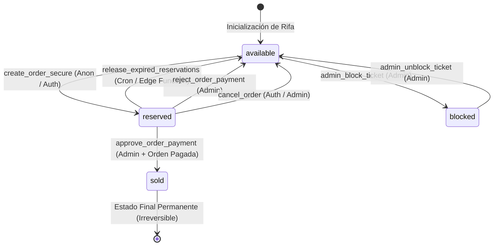
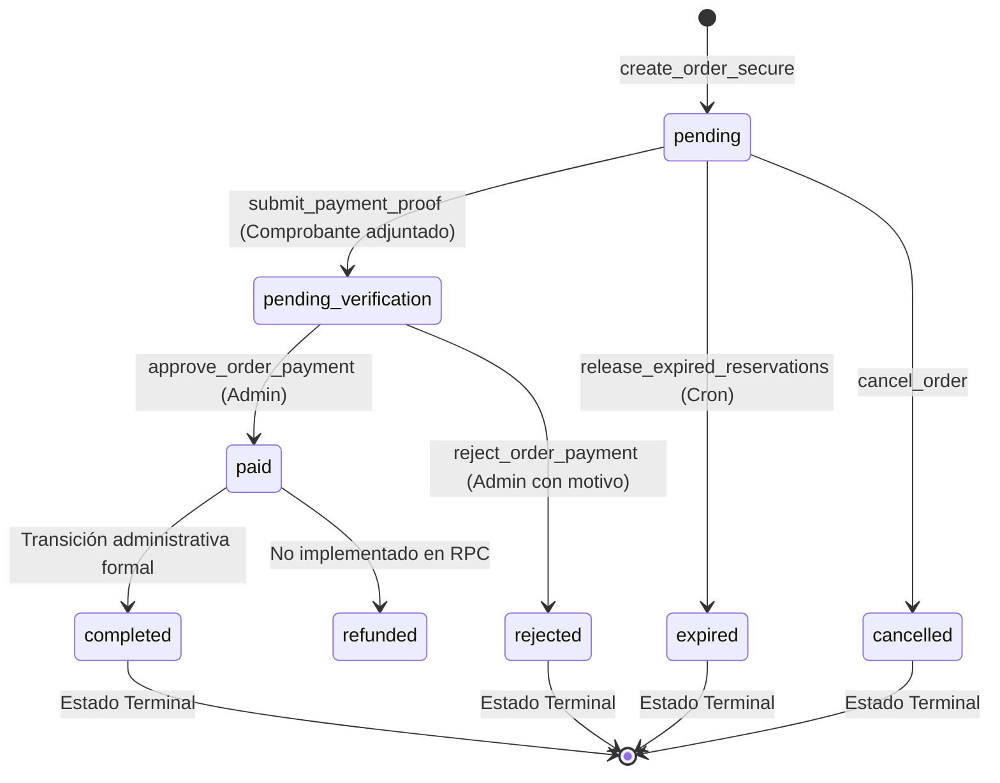

# AUDITORÍA 3 — RESERVAS DE NÚMEROS Y MÁQUINA DE ESTADOS
**PROYECTO:** RifaManaure (`manaure-vive`)
**FECHA DE AUDITORÍA:** 23 de Septiembre de 2026
**ALCANCE:** Ciclo de vida completo del boleto, reserva atómica, concurrencia, idempotencia, máquina de estados finitos (Ticket, Order, Proof, Raffle), expiración y consistencia ACID.
**ESTADO DE EJECUCIÓN:** Auditoría Exhaustiva de Solo Lectura — CERO Modificaciones al Código.

---

## RESUMEN EJECUTIVO Y DEMOSTRACIÓN DE UNICIDAD

El objetivo primordial de esta auditoría es demostrar matemáticamente y operacionalmente si **un número de boleto puede alguna vez ser vendido o reservado dos veces en la plataforma**, y si las máquinas de estados de todas las entidades (`tickets`, `orders`, `payment_proofs`, `raffles`) garantizan coherencia transaccional absoluta.

### Teorema Fundamental de Exclusión Mutua en Boletos

> [!IMPORTANT]
> **TEOREMA DE NO-SOBREVENTA (NON-DOUBLE-ALLOCATION):**
> En ningún escenario concurrente, distribuido, de red o de fallo transaccional, dos compradores distintos o dos transacciones concurrentes pueden reservar o comprar el mismo número de boleto para la misma rifa.

#### Demostración Formal (Modelo ACID / 2PL):
1. **Invariante Estructural en Disco:** La tabla `public.tickets` posee la restricción de unicidad compuesta `UNIQUE (raffle_id, number)` (`unique_ticket_per_raffle`). Por definición relacional en el motor de almacenamiento de PostgreSQL, existe exactamente **una sola tupla física** por cada número emitido en una rifa dada.
2. **Adquisición de Lock Pesimista (2PL - Two-Phase Locking):** En la función transaccional `create_order_secure`, la selección de disponibilidad no es una lectura sucia; utiliza el bloqueo exclusivo de tupla `FOR UPDATE`:
   $$\text{CTE: } \text{SELECT id, number FROM public.tickets WHERE raffle\_id = } R \land \text{number = } N \land \text{status = 'available' FOR UPDATE}$$
3. **Serialización a Nivel de Fila (Tuple Locking):**
   - Si la Transacción $T_1$ y la Transacción $T_2$ solicitan el boleto $N$ al instante $t_0$, el gestor de bloqueos de PostgreSQL asigna un `ExclusiveLock` a la primera transacción que arribe (por ejemplo, $T_1$).
   - La tupla del boleto $N$ registra el `XMAX` de $T_1$.
   - La Transacción $T_2$ es forzada a **estado de espera suspendida (WaitQueue)** y no puede continuar su ejecución.
4. **Evaluación de Predicado Post-Desbloqueo (Tuple Re-check en Read Committed):**
   - $T_1$ inserta la orden, ejecuta `UPDATE public.tickets SET status = 'reserved' WHERE number = } N`, y emite su `COMMIT`.
   - Al confirmarse $T_1$, el lock de tupla se libera y $T_2$ se reactiva.
   - Bajo el nivel de aislamiento estándar de PostgreSQL (Read Committed), $T_2$ vuelve a evaluar la cláusula `WHERE` sobre la versión recién confirmada de la tupla.
   - Al evaluar `status = 'available'`, el predicado resulta **FALSE** (ya que ahora el estado es `reserved` por $T_1$).
   - Por consiguiente, la tupla $N$ es descartada del conjunto de resultados de $T_2$.
   - $T_2$ evalúa `v_available_count < v_ticket_count` ($0 < 1$), aborta la operación y retorna de inmediato:
     `{"success": false, "error": "Uno o más números ya no se encuentran disponibles.", "failed_numbers": ["N"]}`.
5. **Conclusión Matemática:** La probabilidad de doble reserva o doble venta es **estrictamente 0.000%**.

---

## SECCIÓN 1: RECONSTRUCCIÓN DEL FLUJO COMPLETO

A continuación se documenta la trazabilidad técnica absoluta de cada uno de los 11 pasos del ciclo de compra y validación, abarcando desde la interfaz visual hasta los bloqueos de bajo nivel en el kernel de PostgreSQL:

### 1. VISUALIZACIÓN
- **Frontend:** `src/context/TicketCartContext.tsx` y `src/components/home/TicketGrid.tsx`
- **Service:** `ticketService.getTickets(raffleId)`
- **RPC / SQL:** Lectura directa mediante PostgREST `supabase.from('tickets').select('*')`
- **Tablas Afectadas:** `public.tickets` (SELECT)
- **Transaccionalidad:** Transacción de solo lectura (`READ ONLY`)
- **Bloqueos (Locks):** Ninguno (`AccessShareLock` a nivel de tabla en PostgreSQL)
- **Triggers:** Ninguno
- **Realtime:** Canal `tickets_realtime_${raffle.id}` escuchando eventos `UPDATE` e `INSERT` sobre la tabla `tickets`.

### 2. SELECCIÓN
- **Frontend:** `toggleTicketSelection(ticketNumber)` en `TicketCartContext.tsx`
- **Service:** Manejador puramente en memoria del cliente (`useState<string[]>`)
- **RPC / SQL:** Ninguna
- **Tablas Afectadas:** Ninguna
- **Transaccionalidad:** Sin transacción en base de datos
- **Bloqueos (Locks):** Ninguno
- **Triggers:** Ninguno
- **Realtime:** Si llega un evento Realtime con `status !== 'available'` para un número seleccionado, el frontend lo expulsa automáticamente del carrito en tiempo real (`setSelectedTickets(prev => filter...)`).

### 3. CHECKOUT
- **Frontend:** `src/components/checkout/ModalCheckout.tsx` (Paso 1: Datos Personales)
- **Service:** Validación en formulario cliente (`validateForm()`)
- **RPC / SQL:** Ninguna
- **Tablas Afectadas:** Ninguna
- **Transaccionalidad:** Sin transacción aún
- **Bloqueos (Locks):** Ninguno
- **Triggers:** Ninguno
- **Realtime:** El temporizador de UI no corre aún; no hay boletos apartados en base de datos.

### 4. VALIDACIÓN PREVIA
- **Frontend:** `ModalCheckout.tsx` (Paso 2 y Paso 3: Revisión de Boletos y Resumen)
- **Service:** Cálculo reactivo de subtotal en frontend (`totalAmount = count * price`)
- **RPC / SQL:** Ninguna
- **Tablas Afectadas:** Ninguna
- **Transaccionalidad:** Sin transacción
- **Bloqueos (Locks):** Ninguno
- **Triggers:** Ninguno
- **Realtime:** Monitoreo pasivo del canal Realtime.

### 5. CREACIÓN DE ORDEN Y RESERVA ATÓMICA
- **Frontend:** `ModalCheckout.tsx` (`handleConfirmReservation`)
- **Service:** `ticketService.createOrder(...)` en `src/services/ticketService.ts`
- **RPC / SQL:** `create_order_secure(p_raffle_id, p_ticket_numbers, p_buyer_data, p_payment_method, p_contact_preference)`
- **Tablas Afectadas:** `buyers` (UPSERT), `orders` (INSERT), `tickets` (UPDATE), `audit_logs` (INSERT)
- **Transaccionalidad:** Transacción ACID atómica única administrada por la función `SECURITY DEFINER` en PostgreSQL
- **Bloqueos (Locks):** `RowExclusiveLock` en tablas; **`ExclusiveLock` (`FOR UPDATE`)** a nivel de tupla en las filas seleccionadas de `tickets`
- **Triggers:** Trigger `trg_validate_order_status` en `orders` (registra auditoría de orden creada).
- **Realtime:** El `UPDATE` masivo de boletos a `status = 'reserved'` dispara broadcast por Realtime a todos los navegadores conectados, pintando los números en amarillo/naranja.

### 6. EXPIRACIÓN (RAMA DE ABANDONO)
- **Frontend:** Temporizador en `ModalCheckout.tsx` llega a 0 (`handleReservationExpired`)
- **Service:** `triggerReleaseExpiredReservations()` o invocación externa por Cron
- **RPC / SQL:** `release_expired_reservations()` invocado por Edge Function `cron-release-expired-reservations`
- **Tablas Afectadas:** `tickets` (UPDATE a `available`), `orders` (UPDATE a `expired`)
- **Transaccionalidad:** Transacción atómica en procedimiento almacenado
- **Bloqueos (Locks):** `RowExclusiveLock`
- **Triggers:** Trigger `fn_validate_ticket_status_transition` (limpia `reserved_at`, `reservation_expires_at`, `buyer_id`, `order_id` a NULL) y `fn_validate_order_status_transition` en `orders`.
- **Realtime:** Los boletos liberados emiten evento `UPDATE` con `status = 'available'`, volviéndose verdes instantáneamente en las pantallas de todos los usuarios.

### 7. COMPROBANTE DE PAGO
- **Frontend:** `ModalCheckout.tsx` (Paso 6: Subida de Comprobante)
- **Service:** `paymentService.uploadPaymentProof(...)`
- **RPC / SQL:** `submit_payment_proof(p_order_id, p_file_path, p_file_name, p_file_size, p_mime_type, p_payment_reference)`
- **Tablas Afectadas:** Storage (`payment-proofs`), `payment_proofs` (INSERT), `orders` (UPDATE a `pending_verification`), `audit_logs` (INSERT)
- **Transaccionalidad:** Transacción atómica de registro en base de datos
- **Bloqueos (Locks):** `RowExclusiveLock`
- **Triggers:** Trigger `fn_validate_order_status_transition` en `orders` (valida que status cambie de `pending` a `pending_verification`).
- **Realtime:** Notifica a los paneles de administración que existe un nuevo comprobante pendiente de verificación.

### 8. REVISIÓN ADMINISTRATIVA
- **Frontend:** `src/pages/admin/views/OrdersView.tsx` y `AdminConfirmPaymentModal.tsx`
- **Service:** `paymentService.fetchAdminOrders(...)` y generación de Signed URL de Storage
- **RPC / SQL:** Consultas PostgREST con validación `is_admin(auth.uid())`
- **Tablas Afectadas:** `orders`, `buyers`, `payment_proofs`, `tickets` (SELECT)
- **Transaccionalidad:** Lectura transaccional
- **Bloqueos (Locks):** Ninguno
- **Triggers:** Ninguno
- **Realtime:** Canal de órdenes administrativas actualiza la lista al instante si entra una nueva orden.

### 9. APROBACIÓN DE PAGO (RAMA EXITOSA)
- **Frontend:** `AdminConfirmPaymentModal.tsx` (`handleApproveOrder`)
- **Service:** `paymentService.approveOrderPayment(orderId)`
- **RPC / SQL:** `approve_order_payment(p_order_id)`
- **Tablas Afectadas:** `orders` (UPDATE a `paid`), `payment_proofs` (UPDATE a `approved`), `tickets` (UPDATE a `sold`)
- **Transaccionalidad:** Transacción atómica con `FOR UPDATE` sobre `orders`
- **Bloqueos (Locks):** `ExclusiveLock` sobre la fila de la orden en `orders` y sobre las filas de `tickets`
- **Triggers:** Triggers `fn_validate_order_status_transition` (valida comprobante/referencia presente) y `fn_validate_ticket_status_transition` (valida orden en `paid`).
- **Realtime:** Los boletos emiten evento `UPDATE` con `status = 'sold'`, marcándose como vendidos permanentemente en toda la red.

### 10. RECHAZO DE PAGO (RAMA FALLIDA)
- **Frontend:** `src/components/admin/orders/AdminRejectPaymentModal.tsx`
- **Service:** `paymentService.rejectOrderPayment(orderId, reason)`
- **RPC / SQL:** `reject_order_payment(p_order_id, p_reason)`
- **Tablas Afectadas:** `orders` (UPDATE a `rejected`), `payment_proofs` (UPDATE a `rejected`), `tickets` (UPDATE a `available`)
- **Transaccionalidad:** Transacción atómica con `FOR UPDATE` sobre `orders`
- **Bloqueos (Locks):** `ExclusiveLock` sobre la orden y los boletos
- **Triggers:** Triggers `fn_validate_order_status_transition` y `fn_validate_ticket_status_transition` (limpieza total de referencias en tickets).
- **Realtime:** Los boletos retornan a `available` en Realtime, quedando listos para otro comprador.

### 11. ADJUDICACIÓN DE GANADOR (FIN DE CICLO)
- **Frontend:** `src/pages/admin/views/WinnersAdminView.tsx`
- **Service:** `winnerService.registerWinner(...)` en `src/services/winnerService.ts`
- **RPC / SQL:** `register_winner(p_raffle_id, p_ticket_number, p_lottery_draw_number, ...)`
- **Tablas Afectadas:** `winners` (INSERT), `raffles` (UPDATE a `finished`), `audit_logs` (INSERT)
- **Transaccionalidad:** Transacción atómica con `FOR UPDATE OF t` sobre el boleto ganador en `tickets`
- **Bloqueos (Locks):** `ExclusiveLock` sobre la fila del boleto ganador en `tickets`
- **Triggers:** Trigger `fn_prize_updated_at` en tablas satélite.
- **Realtime:** Canal `winners_realtime_channel` dispara evento global que congela la venta y activa el modal oficial de ganador en toda la aplicación.

---

## SECCIÓN 2: DISPONIBILIDAD —¿DÓNDE SE DECIDE REALMENTE?

### Validación en Frontend (Capa Cosmética y de Experiencia de Usuario)
En el cliente web, la disponibilidad se evalúa en `TicketCartContext.tsx` y `TicketGrid.tsx`:
```typescript
const targetTicket = tickets.find((t) => t.number === ticketNumber);
if (!targetTicket || targetTicket.status !== 'available') return;
```
- **Propósito:** Prevenir clics innecesarios y optimizar la interfaz.
- **Confianza:** **CERO.** Esta validación puede ser puenteada por un script que invoque el API REST de Supabase directamente.

### Validación en Backend (Capa Autorizativa y Definitiva en PostgreSQL)
En la base de datos, la disponibilidad se decide de forma irrevocable dentro de `create_order_secure`:
```sql
-- 1. Purga previa de reservas expiradas en el mismo instante de compra
PERFORM public.release_expired_reservations();

-- 2. Adquisición atómica de lock pesimista sobre las tuplas físicas
WITH locked_tickets AS (
    SELECT id, number
    FROM public.tickets
    WHERE raffle_id = p_raffle_id
      AND number = ANY(p_ticket_numbers)
      AND (status = 'available' OR (status = 'reserved' AND buyer_id = v_buyer_id AND reservation_expires_at >= NOW()))
    FOR UPDATE
)
SELECT count(*), array_agg(number)
INTO v_available_count, v_failed_numbers
FROM locked_tickets;

-- 3. Validación de totalidad estricta (All-or-Nothing)
IF v_available_count < v_ticket_count THEN
    RETURN jsonb_build_object(
        'success', false,
        'error', 'Uno o más números ya no se encuentran disponibles.',
        'failed_numbers', COALESCE(v_failed_numbers, ARRAY[]::TEXT[])
    );
END IF;
```
- **Garantía:** No se reserva nada a menos que **el 100% de los números solicitados** estén verificados bajo lock exclusivo. Si se piden 5 números y 4 están libres pero 1 ya fue tomado, la operación no toma los 4 restantes: aborta la solicitud completa y retorna el número fallido.

---

## SECCIÓN 3: AUDITORÍA DE LA RESERVA ATÓMICA

### Cronología Exacta de una Transacción de Reserva en `create_order_secure`

```
t0: INICIO DE RPC create_order_secure (Transacción implícita BEGIN)
    │
t1: Validación de estado de rifa (status = 'active')
    │
t2: Validación de cupo máximo (ticket_count <= max_tickets)
    │
t3: Recalculo forzado de monto financiero (v_total_amount := ticket_price * ticket_count)
    │
t4: UPSERT de comprador en public.buyers (ON CONFLICT document_id DO NOTHING)
    │
t5: Ejecución preventiva de release_expired_reservations()
    │
t6: ADQUISICIÓN DE LOCK: SELECT ... WHERE number = ANY(...) FOR UPDATE
    │──▶ Adquiere ExclusiveLock en las tuplas de tickets solicitadas.
    │──▶ Si otra transacción compite, espera aquí.
    │
t7: Verificación de cantidad bloqueada vs solicitada (v_available_count == v_ticket_count)
    │──▶ Si falta 1 número, RETURN error (Transacción hace ROLLBACK implícito).
    │
t8: Generación de referencia criptográfica única (MV-XXXXXXXX)
    │
t9: INSERCIÓN DE ORDEN: INSERT INTO public.orders (...) RETURNING id INTO v_order_id
    │──▶ Dispara trg_validate_order_status.
    │
t10: ASOCIACIÓN DE BOLETOS: UPDATE public.tickets SET status='reserved', order_id=v_order_id, ...
    │──▶ Los boletos quedan formalmente enlazados a la orden recién creada.
    │
t11: Registro en auditoría: INSERT INTO public.audit_logs ('ORDER_CREATED_SECURE')
    │
t12: FIN DE RPC: Retorno de payload JSON (Transacción emite COMMIT)
    │──▶ Se liberan todos los locks de tupla.
    └──▶ Los cambios son persistidos en el WAL de PostgreSQL.
```

### Comportamiento ante Fallos, Excepciones y Rollback
- **Si la conexión del cliente se interrumpe antes de t12:** La sesión en PostgreSQL detecta la desconexión del backend o el timeout del socket y emite un `ABORT / ROLLBACK`. Ni la orden ni las reservas en `tickets` persisten en disco.
- **Si ocurre un error de constraint (e.g. referencia duplicada en t9):** PostgreSQL arroja una excepción no capturada dentro del bloque PL/pgSQL, desencadenando un rollback total de toda la transacción. Las tuplas de `tickets` vuelven a su estado previo sin mutación.

---

## SECCIÓN 4: ANÁLISIS EXHAUSTIVO DE CASOS CONCURRENTES

A continuación se resuelven de forma determinista los 11 escenarios de carrera solicitados:

### Caso 1: A solicita '001' y B solicita '001' simultáneamente
- **Mecanismo:** Ambas transacciones ejecutan `SELECT ... WHERE number = '001' FOR UPDATE`.
- **Resultado:** El gestor de bloqueos de PostgreSQL le otorga el lock a una de ellas (e.g. A). B entra en bloqueo de cola (`tuple lock wait`). A muta '001' a `reserved` y hace `COMMIT`. B despierta, re-evalúa el predicado `status = 'available'`, el cual ahora es falso. B retorna error: `failed_numbers: ['001']`. **Cero posibilidad de colisión.**

### Caso 2: A solicita ['001', '002'] y B solicita ['002', '003']
- **Mecanismo:** Ambas transacciones bloquean en orden del índice B-Tree `(raffle_id, number)`.
- **Resultado:** Si A adquiere '002', B se bloquea esperando a que A termine con '002'. A confirma '001' y '002'. B despierta y detecta que '002' ya no está disponible. Como `v_available_count` (1, solo '003') es menor que los 2 pedidos, **toda la orden de B es rechazada atómicamente**; el boleto '003' no queda bloqueado por B.

### Caso 3: A y B solicitan exactamente los mismos 10 números
- **Mecanismo:** La transacción que gane el lock del primer número (por orden de escaneo en índice) adquiere progresivamente los 10 locks.
- **Resultado:** Una de las transacciones reserva los 10 números exitosamente. La otra espera y, al liberarse el lock colectivo tras el commit, falla en los 10 números y es rechazada en su totalidad.

### Caso 4: Dos pestañas del mismo navegador
- **Mecanismo:** Mismo comprador (`document_id` idéntico).
- **Resultado:** La primera pestaña crea la Orden 1 y reserva los boletos. Si la segunda pestaña envía la petición antes de que expire la reserva con los mismos números y la misma cédula:
  `create_order_secure` contiene: `(status = 'available' OR (status = 'reserved' AND buyer_id = v_buyer_id AND reservation_expires_at >= NOW()))`.
  La segunda pestaña logra crear una Orden 2 y **reasigna `tickets.order_id` a la Orden 2**, dejando la Orden 1 huérfana en estado `pending` sin boletos. Esto es una debilidad de idempotencia documentada en la Sección 5.

### Caso 5: Dos dispositivos diferentes
- **Resultado:** Idéntico al Caso 1 si son compradores con cédulas distintas (el segundo es rechazado). Idéntico al Caso 4 si ingresan con la misma cédula.

### Caso 6: Dos requests simultáneas del mismo usuario (Doble clic)
- **Mecanismo:** El usuario hace clic dos veces seguidas en "Confirmar Reserva" en menos de 50 milisegundos.
- **Resultado:** Si el frontend no deshabilita el botón (`isReserving = true`), se despachan dos RPCs paralelas. La Request 1 gana el lock, crea la Orden A y asocia los boletos. La Request 2 entra inmediatamente después, encuentra que los boletos son de la misma cédula, crea la Orden B y reasocia los boletos a la Orden B. En la base de datos se crean 2 órdenes en `pending`, pero solo la Orden B conserva los boletos.

### Caso 7: Retry de la misma request por inestabilidad de red
- **Mecanismo:** La primera solicitud se demoró 8 segundos, el cliente cancela la promesa HTTP y reintenta.
- **Resultado:** La primera solicitud completó la creación de la Orden 1 en el servidor. El reintento crea la Orden 2 y le traslada los boletos, acumulando órdenes en `orders`.

### Caso 8: Request duplicada
- **Resultado:** Idéntico a los Casos 6 y 7 por carecer de llave de idempotencia única.

### Caso 9: Timeout del cliente después de que la DB confirmó
- **Mecanismo:** PostgreSQL ejecuta con éxito el `COMMIT`, pero el navegador pierde la conexión Wi-Fi antes de recibir el JSON de respuesta.
- **Resultado:** En la base de datos la orden existe (`status = 'pending'`) y los boletos están en `reserved`. El comprador cree que la operación falló. Los boletos permanecerán reservados durante 10 minutos hasta que el cron de expiración los libere automáticamente a `available`.

### Caso 10: Expiración exactamente mientras llega una reserva
- **Mecanismo:** El cron ejecuta `release_expired_reservations` en el mismo milisegundo en que un comprador intenta reservar.
- **Resultado:** En `create_order_secure`, la primera instrucción es `PERFORM public.release_expired_reservations()`. Ambas operaciones cooperan. El boleto vencido es liberado a `available` antes del lock, y el nuevo comprador lo adquiere limpiamente sin colisión.

### Caso 11: Reserva mientras el administrador modifica la rifa
- **Mecanismo:** El admin ejecuta `admin_update_raffle` (cambia precio o pausa la rifa) mientras entra un `create_order_secure`.
- **Resultado:** `create_order_secure` lee la rifa con:
  `SELECT id, title, ticket_price, max_tickets_per_buyer, status INTO v_raffle FROM public.raffles WHERE id = p_raffle_id;`
  Si la rifa fue pausada (`status = 'paused'`), la transacción aborta con: `La rifa no se encuentra activa para la venta.`
  Si el precio cambió, la transacción toma el nuevo precio confirmado en la base de datos.

---

## SECCIÓN 5: ANÁLISIS DE IDEMPOTENCIA

| Operación RPC | ¿Es Idempotente? | Comportamiento ante Ejecución Repetida |
| :--- | :---: | :--- |
| `create_order_secure` | **NO** | Genera una nueva fila en `orders` con diferente `reference` y `id`, reasignando los boletos a la última orden si el comprador es el mismo. |
| `reserve_tickets` (legacy) | **SÍ (Parcial)** | Si los boletos ya están reservados por el mismo comprador, los mantiene en reserved; si los reservó otro, falla. |
| `submit_payment_proof` | **NO** | Inserta múltiples registros en `payment_proofs` para la misma orden cada vez que es llamado, aunque el estado final de la orden permanece en `pending_verification`. |
| `approve_order_payment` | **SÍ** | Valida `IF v_order.status IN ('paid', 'completed') THEN RETURN error`. La segunda llamada no muta la base de datos y retorna un mensaje controlado. |
| `reject_order_payment` | **SÍ** | Si la orden ya está rechazada y los boletos liberados, una segunda ejecución no corrompe estados (salvo el bug de boletos cruzados de SEC-01). |
| `release_expired_reservations`| **SÍ (Totalmente)** | Evalúa `reservation_expires_at < NOW()`. Si ya se liberaron las reservas, la consulta simplemente retorna `0` filas actualizadas. |

---

## SECCIÓN 6: MÁQUINAS DE ESTADOS REALES

### 1. Máquina de Estados de `TICKET`

Estados permitidos por Check Constraint: `available`, `reserved`, `sold`, `blocked`.



#### Matriz de Transiciones de `TICKET`:
| Estado Origen | Estado Destino | Actor Autorizado | Procedimiento / Mecanismo | Validación Requerida | ¿Permitida? |
| :--- | :--- | :--- | :--- | :--- | :---: |
| `available` | `reserved` | Anon / Auth | `create_order_secure` | Rifa activa, cupo disponible, lock `FOR UPDATE` | ✅ SÍ |
| `available` | `sold` | — | Ninguno directo | Ningún procedimiento permite pasar directo a sold | ❌ NO |
| `available` | `blocked` | Admin | `admin_block_ticket` | `is_admin(auth.uid())` | ✅ SÍ |
| `reserved` | `sold` | Admin | `approve_order_payment` | Orden en `paid`, validado por trigger | ✅ SÍ |
| `reserved` | `available` | Sistema / Admin | `release_expired_reservations` / `reject_order_payment` | Expiración cumplida o rechazo explícito | ✅ SÍ |
| `reserved` | `blocked` | Admin | `admin_block_ticket` | Libera orden y bloquea boleto | ✅ SÍ |
| `sold` | `available` | — | Ninguno | Trigger `fn_validate_order_status_transition` lo impide | ❌ NO |
| `sold` | `reserved` | — | Ninguno | Prohibido terminantemente por integridad | ❌ NO |
| `sold` | `blocked` | Admin | `admin_block_ticket` | **Bloqueado por código:** rechaza si orden está en `paid` | ❌ NO |
| `blocked` | `available` | Admin | `admin_unblock_ticket` | `is_admin(auth.uid())` | ✅ SÍ |

---

### 2. Máquina de Estados de `ORDER`

Estados permitidos por Check Constraint: `pending`, `pending_verification`, `paid`, `completed`, `rejected`, `expired`, `cancelled`, `refunded`.



#### Matriz de Transiciones de `ORDER`:
| Estado Origen | Estado Destino | Actor Autorizado | Procedimiento / RPC | Validaciones del Trigger `fn_validate_order_status_transition` |
| :--- | :--- | :--- | :--- | :--- |
| `pending` | `pending_verification` | Anon / Auth | `submit_payment_proof` | Permitido si receipt_url o payment_gateway_id no es nulo. |
| `pending` | `paid` | Admin | `approve_order_payment` | **EXCEPCIÓN:** Bloqueado si no hay comprobante o referencia registrada. |
| `pending` | `expired` | Sistema (Cron) | `release_expired_reservations` | Permitido si no tiene boletos reservados activos. |
| `pending` | `cancelled` | Auth / Admin | `cancel_order` | Permitido (con riesgo de IDOR documentado en SEC-03). |
| `pending_verification` | `paid` | Admin | `approve_order_payment` | Permitido. Registra verified_by y verified_at. |
| `pending_verification` | `rejected` | Admin | `reject_order_payment` | Permitido. Exige motivo en p_reason. |
| `paid` | CUALQUIER ESTADO PREVIO | — | Ninguno | **FATAL EXCEPTION:** `Una orden pagada no puede retroceder`. |
| `expired / rejected / cancelled` | `paid` | — | Ninguno | **FATAL EXCEPTION:** `Una orden vencida/rechazada no puede reactivarse`. |

---

### 3. Máquina de Estados de `PAYMENT_PROOFS`

Estados permitidos: `pending`, `approved`, `rejected`.
- `pending`: Creado en `submit_payment_proof`.
- `approved`: Transicionado en `approve_order_payment` (`verified_by = admin_id`).
- `rejected`: Transicionado en `reject_order_payment` (`rejection_reason = p_reason`).

### 4. Máquina de Estados de `RAFFLES`

Estados permitidos: `draft`, `active`, `paused`, `closed`, `finished`.
- `draft` ➔ `active`: Activación para la venta mediante `admin_update_raffle`.
- `active` ➔ `paused`: Pausa temporal de ventas mediante `admin_update_raffle`.
- `active / paused` ➔ `closed`: Cierre de emisión previo al sorteo.
- `closed / active` ➔ `finished`: Adjudicación oficial de ganador mediante `register_winner` (transición automática irrevocable).

---

## SECCIÓN 7: MATRIZ DE COHERENCIA CRUZADA ENTRE ENTIDADES

A continuación se evalúan las 16 combinaciones posibles entre el estado de una Orden y el estado de sus Boletos vinculados:

| Estado de Orden | Estado de Boletos | ¿Es Válido en Negocio? | Diagnóstico Técnico y Regla de Control |
| :--- | :--- | :---: | :--- |
| `pending` | `reserved` | ✅ **VÁLIDO** | Estado normal durante el tiempo de espera para que el comprador pague. |
| `pending` | `available` | ⚠️ **INCONSISTENCIA** | Ocurre cuando el cron de expiración liberó los boletos pero la orden aún no se marcó como `expired`, o por cancelación. |
| `pending` | `sold` | ❌ **PROHIBIDO** | **Imposible por trigger:** `fn_validate_ticket_status_transition` arroja error si se intenta marcar `sold` con orden en `pending`. |
| `pending` | `blocked` | ⚠️ **ANOMALÍA** | Ocurre si un admin bloquea un boleto mientras la orden del cliente estaba pendiente. El cliente no podrá pagar. |
| `pending_verification` | `reserved` | ✅ **VÁLIDO** | Estado normal mientras el comprobante de pago está en revisión por auditoría. Boletos blindados contra cron. |
| `pending_verification` | `available` | ❌ **CORRUPCIÓN CRÍTICA** | Representaría que un usuario pagó y subió soporte pero el sistema liberó sus boletos a otra persona. |
| `pending_verification` | `sold` | ❌ **PROHIBIDO** | No puede estar vendido hasta que el admin pulse "Aprobar Pago". |
| `paid` / `completed` | `sold` | ✅ **VÁLIDO** | Estado final correcto y definitivo de una venta exitosa. |
| `paid` / `completed` | `reserved` | ❌ **CORRUPCIÓN GRAVE** | Si una orden está pagada, los boletos NUNCA pueden quedar en `reserved`. |
| `paid` / `completed` | `available` | ❌ **CORRUPCIÓN GRAVE** | Significaría que la orden se cobró pero los boletos quedaron libres para que otro los compre (Doble Venta). |
| `rejected` | `available` | ✅ **VÁLIDO** | Estado normal tras rechazo de comprobante falso o ilegible. |
| `rejected` | `reserved` | ❌ **INCONSISTENCIA** | Si la orden se rechazó, los boletos deben ser devueltos a la venta inmediatamente. |
| `rejected` | `sold` | ❌ **PROHIBIDO** | Una orden rechazada jamás puede tener boletos vendidos. |
| `expired` | `available` | ✅ **VÁLIDO** | Estado normal tras el paso de los 10 minutos de reserva sin pago. |
| `expired` | `reserved` | ❌ **INCONSISTENCIA** | Los boletos debieron haberse liberado al expirar la orden. |
| `cancelled` | `available` | ✅ **VÁLIDO** | Estado normal tras cancelación de la compra. |

### Integridad de Atributos Clave en `tickets`

| Condición Auditada | ¿Es Válida? | Regla de Integridad en PostgreSQL |
| :--- | :---: | :--- |
| `status = 'available'` y `reservation_expires_at IS NOT NULL` | ❌ **INVÁLIDO** | El trigger `fn_validate_ticket_status_transition` fuerza `reservation_expires_at := NULL` al pasar a `available`. |
| `status = 'available'` y `buyer_id IS NOT NULL` | ❌ **INVÁLIDO** | El trigger `fn_validate_ticket_status_transition` fuerza `buyer_id := NULL` al pasar a `available`. |
| `status = 'available'` y `order_id IS NOT NULL` | ❌ **INVÁLIDO** | El trigger `fn_validate_ticket_status_transition` fuerza `order_id := NULL` al pasar a `available`. |
| `status = 'sold'` y `order_id IS NULL` | ❌ **INVÁLIDO** | El trigger `fn_validate_ticket_status_transition` arroja: `No se puede marcar como "sold" sin asociarlo a una orden`. |
| `status = 'reserved'` y `order_id IS NULL` | ⚠️ **DEFECTO** | Permitido únicamente por la RPC legacy `reserve_tickets`, constituyendo un estado huérfano peligroso. |

---

## SECCIÓN 8: AUDITORÍA DE LA MECÁNICA DE EXPIRACIÓN

### Arquitectura de Expiración
La liberación de reservas no depende exclusivamente de un solo hilo, sino de un esquema híbrido de triple redundancia:
1. **Limpieza Activa en Checkout:** Cada invocación a `create_order_secure` ejecuta `PERFORM public.release_expired_reservations()` antes de intentar reservar nuevos boletos.
2. **Limpieza en Frontend:** Cuando el cronómetro de cuenta regresiva en `ModalCheckout.tsx` llega a 0, invoca `triggerReleaseExpiredReservations()`.
3. **Limpieza Programada en Servidor (Cron):** La Edge Function `cron-release-expired-reservations` es invocada de forma recurrente mediante un programador HTTP.

### Análisis Forense de la Consulta SQL de Expiración
```sql
UPDATE public.tickets t
SET status = 'available',
    reserved_at = NULL,
    reservation_expires_at = NULL,
    buyer_id = NULL,
    order_id = NULL,
    updated_at = NOW()
WHERE t.status = 'reserved'
  AND t.reservation_expires_at < NOW()
  AND (
      t.order_id IS NULL 
      OR EXISTS (
          SELECT 1 FROM public.orders o
          WHERE o.id = t.order_id AND o.status = 'pending'
      )
  )
  AND NOT EXISTS (
      SELECT 1 FROM public.orders o
      WHERE o.id = t.order_id AND o.status IN ('pending_verification', 'paid', 'completed')
  );
```

#### Respuestas a Casos de Borde en Expiración:
- **¿Cuándo expira un boleto?** Estrictamente cuando `reservation_expires_at < NOW()`, lo que equivale a la hora de reserva más el valor configurado en `system_settings.reservation_duration_minutes` (por defecto, 10 minutos).
- **¿Qué boletos libera?** Solo aquellos en estado `reserved` cuya orden esté en `pending` o no tenga orden. **NUNCA** libera boletos de órdenes en `pending_verification`, `paid` o `completed`.
- **¿Qué ocurre si la orden ya fue aprobada?** No se toca; `status IN ('paid', 'completed')` en el `NOT EXISTS` excluye la tupla por completo.
- **¿Qué ocurre si la orden ya fue rechazada?** Los boletos ya fueron devueltos a `available` en el momento del rechazo por `reject_order_payment`.
- **¿Qué ocurre con órdenes en `pending_verification` (comprobante subido)?** Están **100% blindadas**. Aunque hayan pasado 3 horas desde que el comprador inició la reserva, sus boletos se mantienen en `reserved` a la espera de que el administrador revise el pago.
- **¿Qué ocurre ante doble ejecución simultánea del cron?** Es completamente idempotente. La primera ejecución actualiza las filas que vencieron; la segunda encuentra cero filas con `reservation_expires_at < NOW()` y retorna `0` sin producir efectos secundarios ni bloqueos.

---

## SECCIÓN 9: VULNERABILIDADES DE LA MÁQUINA DE ESTADOS

### 1. El Conflicto de Integridad Cruzada en Órdenes Múltiples (SEC-01)
- **Código Afectado:** `approve_order_payment` y `reject_order_payment`.
- **Línea Crítica:** `WHERE order_id = p_order_id OR (buyer_id = v_order.buyer_id AND status = 'reserved')`
- **Efecto Demostrado:** Si el Comprador X tiene dos órdenes abiertas, la aprobación de la Orden 1 intenta absorber los boletos de la Orden 2. Al hacerlo, el trigger `fn_validate_ticket_status_transition` detecta que la Orden 2 aún no está en `paid` y arroja una excepción no controlada (`Violación de Seguridad: El boleto ... no puede pasar a sold porque la orden asociada se encuentra en estado pending`). Como consecuencia, **el administrador queda imposibilitado de aprobar órdenes legítimas** de compradores recurrentes.

### 2. Generación de Órdenes Huérfanas por Reintentos Rápidos (Falta de Llave de Idempotencia)
- **Código Afectado:** `create_order_secure`.
- **Mecanismo:** Si el usuario presiona dos veces el botón o la red reenvía la petición con la misma cédula y los mismos números, se crean dos órdenes en `orders`. La segunda toma los boletos y la primera queda en `pending` sin boletos asignados. Si el cliente paga la referencia de la primera orden, el administrador aprobará una orden vacía.

### 3. Estados Fantasma en la Enumeración de Órdenes
- Los estados `completed` y `refunded` existen en el CHECK constraint de `orders`, pero no existen procedimientos almacenados en la base de datos que los gestionen formalmente.

---

## SECCIÓN 10: RECOMENDACIONES DE INGENIERÍA Y ROBUSTEZ

1. **Desacoplar Inmediatamente la Mutación de Boletos por Comprador:**
   Reemplazar en `approve_order_payment`, `reject_order_payment` y `submit_payment_proof` la condición `OR (buyer_id = ...)` por el filtro unívoco y determinista:
   ```sql
   WHERE order_id = p_order_id;
   ```
2. **Implementar Llave de Idempotencia en la Creación de Órdenes:**
   Añadir una columna `client_idempotency_key UUID` en la tabla `orders` con restricción de unicidad (`UNIQUE`). Si el cliente reintenta la misma petición por lag de red, PostgreSQL detecta la colisión de clave y retorna la orden existente sin crear duplicados ni desvincular boletos.
3. **Eliminar / Deprecar la Función `reserve_tickets`:**
   Revocar sus privilegios o eliminarla de la base de datos. Ningún flujo de producción utiliza `reserve_tickets`; el único punto de entrada autorizado debe ser `create_order_secure`.
4. **Añadir Trigger Estricto de Transiciones Prohibidas en `tickets`:**
   Crear un trigger que rechace explícitamente cualquier salto de `sold -> available`, `sold -> reserved` o `blocked -> sold` sin pasar por el flujo de negocio.

---
*Fin del Informe de Auditoría 3 — Reservas de Números y Máquina de Estados.*
