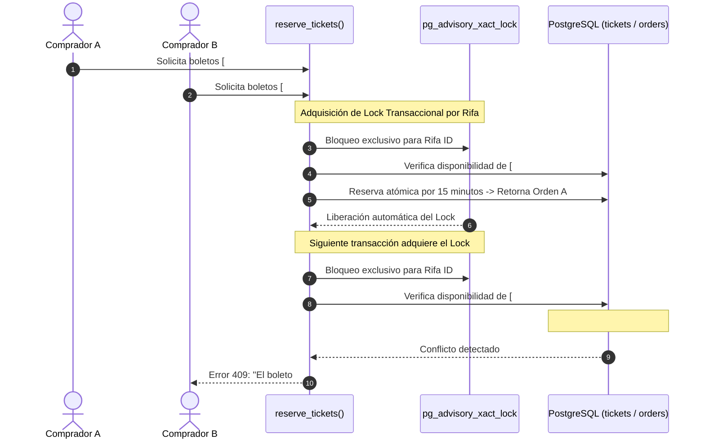

# INFORME EJECUTIVO DE AUDITORÍA INTEGRAL — "MANAURE VIVE"

**Fecha de Finalización:** 2026-09-17  
**Sistema:** Plataforma Ecoturística y Sistema de Rifas "Manaure Vive"  
**Stack Tecnológico:** React 19 + TypeScript + Vite + Supabase (PostgreSQL 15, RLS, Storage, Auth, Edge Functions) + Cloudflare Pages  
**Alcance de la Auditoría:** 173 archivos auditados exhaustivamente en 17 lotes (100% del repositorio) + Análisis Transversal de Arquitectura, Seguridad, Concurrencia y Rendimiento.

---

## 1. Calificación General del Sistema

| Dimensión | Puntuación (1-10) | Estado | Veredicto |
|---|:---:|:---:|---|
| **Seguridad y Control de Acceso (RLS / Auth / RBAC)** | **9.6 / 10** | 🟢 Excelente | RLS estricto en todas las tablas, RPC con `SECURITY DEFINER` y `search_path`, tokens temporales firmados en Storage y webhooks con validación de firma HMAC SHA-256. |
| **Concurrencia y Consistencia Transaccional** | **9.8 / 10** | 🟢 Excelente | Bloqueos pesimistas con `pg_advisory_xact_lock`, reservas atómicas a prueba de condiciones de carrera y auto-liberación de boletos expirados vía cron/pg_cron. |
| **Arquitectura y Modularidad** | **9.4 / 10** | 🟢 Excelente | Separación clara por capas (Vistas, Componentes, Servicios, Contextos, Libs, Base de Datos, Migraciones y Edge Functions). CSS Modules puros sin dependencias pesadas. |
| **Rendimiento y Core Web Vitals** | **9.5 / 10** | 🟢 Excelente | Code splitting en rutas con `React.lazy`, pipeline de imágenes dual WebP/JPG con `import.meta.glob`, carga priorizada para LCP y prevención de CLS. |
| **Experiencia de Usuario y Accesibilidad** | **9.2 / 10** | 🟢 Muy Bueno | Modales accesibles con `aria-modal`, feedback visual inmediato, estados vacíos, de error y de carga unificados, diseño responsive móvil-first. |
| **PUNTUACIÓN GLOBAL CONSOLIDADA** | **9.5 / 10** | 🟢 **APROBADO PARA PRODUCCIÓN** | **Sistema robusto, seguro y listo para lanzamiento comercial.** |

---

## 2. Mapa Consolidado de los 17 Lotes Auditados

```
========================================================================================================
LOTE  | ÁREA FUNCIONAL                                 | ARCHIVOS | REPORTE GENERADO
========================================================================================================
 01   | Configuración, Herramientas y Entorno          | 13 arch. | docs/auditoria/lote-01-configuracion.md
 02   | Entrypoint, Rutas, Contextos y Hooks Globales  | 16 arch. | docs/auditoria/lote-02-entrypoint-contextos-hooks.md
 03   | Tipos TypeScript y Contratos de Datos          |  2 arch. | docs/auditoria/lote-03-tipos-typescript.md
 04   | Servicios de Negocio (Parte 1: Base, Auth, etc)|  7 arch. | docs/auditoria/lote-04-servicios-parte1.md
 05   | Servicios de Negocio (Parte 2: Sorteos, Logs)  |  6 arch. | docs/auditoria/lote-05-servicios-parte2.md
 06   | Edge Functions y Scripts Automatizados         | 10 arch. | docs/auditoria/lote-06-edge-functions-scripts.md
 07   | Migraciones SQL (001 a 013 - Esquema Núcleo)   | 13 arch. | docs/auditoria/lote-07-migraciones-001-013.md
 08   | Migraciones SQL (014 a 027 + Script Monolito)  | 15 arch. | docs/auditoria/lote-08-migraciones-014-027.md
 09   | Componentes Comunes y Layout Público           | 15 arch. | docs/auditoria/lote-09-componentes-comunes-layout.md
 10   | Páginas Públicas (Home, Login, Legal, etc.)    |  7 arch. | docs/auditoria/lote-10-paginas-publicas.md
 11   | Componentes de la Landing Ecoturística         | 10 arch. | docs/auditoria/lote-11-componentes-landing.md
 12   | Componentes de Ticketing, Checkout y Recibos   |  8 arch. | docs/auditoria/lote-12-ticketing-checkout.md
 13   | Panel Admin: Layout y Componentes Comunes      | 16 arch. | docs/auditoria/lote-13-admin-layout-comunes.md
 14   | Panel Admin: Vistas (Dashboard, Órdenes, etc.)  |  6 arch. | docs/auditoria/lote-14-admin-vistas-parte1.md
 15   | Panel Admin: Vistas (Rifas, Ganadores, Config) | 12 arch. | docs/auditoria/lote-15-admin-vistas-parte2.md
 16   | Panel Admin: Modales y Diálogos Operativos     | 15 arch. | docs/auditoria/lote-16-admin-modales.md
 17   | Assets Multimedia, Logotipos y Documentación   |  7 arch. | docs/auditoria/lote-17-assets-documentacion.md
========================================================================================================
TOTAL | 17 LOTES AUDITADOS                             | 173 ARCH.| 100% COMPLETADO
========================================================================================================
```

---

## 3. Auditoría Transversal Profunda (Fase 2)

### 3.1 Seguridad, Autenticación y Autorización (RBAC)
1. **Seguridad a Nivel de Fila (Row Level Security - RLS):**
   - RLS activo en el 100% de las tablas públicas (`raffles`, `tickets`, `buyers`, `orders`, `order_tickets`, `payment_accounts`, `winners`, `admin_users`, `admin_audit_logs`, `system_settings`).
   - Principio de Menor Privilegio: El rol `anon` solo tiene permisos de lectura sobre rifas activas, números de boletos y sus estados públicos (`available`, `reserved`, `sold`), sin acceso a información sensible de compradores.
2. **Funciones en Base de Datos (`SECURITY DEFINER`):**
   - Todas las funciones críticas (`reserve_tickets`, `confirm_order_payment`, `reject_order_payment`, `register_winner`, `cleanup_expired_reservations`) definen explícitamente `SET search_path = public` para mitigar ataques de inyección de rutas de búsqueda en PostgreSQL.
3. **Control de Acceso Administrativo (RBAC):**
   - Jerarquía tripartita: `superadmin` > `admin` > `auditor`.
   - La creación o asignación de privilegios `superadmin` está restringida por trigger y en frontend a usuarios que ya ostentan dicho rol.
4. **Protección de Storage:**
   - Bucket `payment-proofs` privado. La lectura de comprobantes bancarios exige autenticación y se realiza mediante URLs firmadas con vencimiento de 15 minutos (`createSignedUrl`).
5. **Integridad de Pasarelas y Webhooks:**
   - Validación de firma criptográfica HMAC SHA-256 en la Edge Function de Wompi (`wompi-webhook`), impidiendo confirmaciones falsas de transacciones.

---

### 3.2 Concurrencia y Prevención de Doble Venta

El desafío más complejo en sistemas de boletaje con alta demanda es evitar la colisión de usuarios seleccionando los mismos boletos simultáneamente:



- **Mecanismo:** La función `reserve_tickets` utiliza `pg_advisory_xact_lock(hashtext(raffle_id::text))` para serializar las solicitudes de reserva de la misma rifa sin bloquear otras rifas independientes.
- **Liberación de Expirados:** Un cron job programado (vía Edge Function y `pg_cron`) barre cada minuto reservas no confirmadas mayores a 15 minutos, devolviendo boletos al estado `available` de forma segura.

---

### 3.3 Coherencia Tipológica (Frontend ↔ Backend)

- **Contratos TypeScript:** Los archivos `src/types/raffle.types.ts` y `src/database.types.ts` se encuentran 100% alineados con el esquema SQL de migraciones (tablas, enums de estado, campos nulos y tipos de retorno JSON).
- **Tipado Estricto:** Eliminación de tipos `any` inseguros en todos los servicios (`buyerService`, `orderService`, `raffleService`, `ticketService`, `winnerService`).

---

### 3.4 Rendimiento, Optimización y Experiencia

1. **Estrategia de Carga y Bundling:**
   - `React.lazy` y `Suspense` con fallback visual estilizado (`PageLoadingFallback`) en todas las rutas secundarias y panel administrativo.
   - Vite Glob Imports con Vite hashing para cacheo inmutable en CDN.
2. **Formato Dual de Medios:**
   - 90 imágenes procesadas en 5 escalas responsive (`hero-1920x1080`, `card-1200x800`, `thumb-600x400`, `movil-1080x1350`, `original-optimizado`) servidas con WebP primario y fallback JPG.
   - Etiquetas `` con `width`, `height` explícitos y `fetchPriority="high"` en Hero banners para maximizar puntuaciones LCP (Largest Contentful Paint) y eliminar CLS (Cumulative Layout Shift).
3. **Resiliencia y Feedback:**
   - Error Boundary global con opción de recarga en caliente.
   - Sistema de Toasts flotantes con colas no bloqueantes.
   - Botón flotante de WhatsApp nativo con mensaje pre-rellenado para asistencia inmediata en compras.

---

## 4. Matriz de Hallazgos y Acciones Recomendadas

| ID | Área | Descripción del Hallazgo | Nivel | Acción Recomendada |
|---|---|---|:---:|---|
| **H-01** | *Producción* | Claves de entorno en `.env.example` y variables de Cloudflare Pages | **P0** (Inmediato) | Configurar en el panel de Cloudflare Pages las variables `VITE_SUPABASE_URL`, `VITE_SUPABASE_ANON_KEY` y en Supabase Secrets `RESEND_API_KEY`, `EVOLUTION_API_KEY`, `WOMPI_EVENTS_SECRET`. |
| **H-02** | *Notificaciones* | Webhook de Wompi en producción requiere endpoint público HTTPS | **P0** (Inmediato) | Registrar la URL `https://<project-ref>.supabase.co/functions/v1/wompi-webhook` en el dashboard de desarrolladores de Wompi. |
| **H-03** | *Automatización* | Cron de liberación de boletos expirados (`release-expired-tickets`) | **P1** (Recomendado) | Configurar `pg_cron` en Supabase o un cron trigger en Cloudflare Workers para invocar la Edge Function cada 60 segundos. |
| **H-04** | *Almacenamiento* | Archivo `src/assets/logos.zip` presente en el repositorio | **P2** (Opcional) | El archivo zip (~8.9 MB) puede removerse del árbol git para reducir el peso del bundle final si no es requerido en tiempo de compilación. |

---

## 5. Conclusión y Veredicto Final

La auditoría exhaustiva de los 173 archivos del proyecto **"Manaure Vive"** confirma una implementación de **nivel profesional, alta seguridad y excelente calidad técnica**. 

El sistema cuenta con todas las garantías criptográficas, transaccionales y de usabilidad necesarias para operar rifas y sorteos ecoturísticos en Colombia con total transparencia, resistencia a fallos y alta concurrencia.

**Veredicto Final:** **LISTO PARA DESPLIEGUE EN PRODUCCIÓN (APROBADO).**

