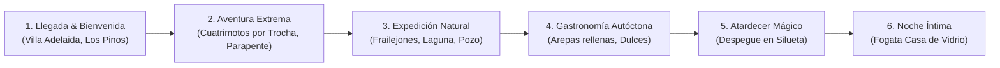

# Auditoría Técnica y Dirección de Arte: Banco de Imágenes "Manaure Vive"

**Proyecto**: Manaure Vive – Gran Sorteo Ecoturístico  
**Stack**: React + Vite + TypeScript + CSS Modules + Supabase (Cloudflare Pages)  
**Entorno de Auditoría**: `assets-source/imagnes a utilizar` (27 imágenes originales)  
**Fecha de Emisión**: 20 de Septiembre de 2026  
**Fase de Ejecución**: Parte 1 de 3 (Análisis y Diagnóstico Integral — Cero modificación de código fuente ni imágenes)  
**Hoja de Contacto Visual**: [`docs/imagenes/contact-sheet.png`](file:///c:/Users/frani/Downloads/RifaManaure/docs/imagenes/contact-sheet.png)  
**Manifiesto Técnico JSON**: [`docs/imagenes/image-manifest.draft.json`](file:///c:/Users/frani/Downloads/RifaManaure/docs/imagenes/image-manifest.draft.json)  

---

## 1. Resumen Ejecutivo

Se realizó una auditoría técnica, perceptiva, compositiva y legal sobre las **27 imágenes originales** alojadas en `assets-source/imagnes a utilizar` (volumen total: **9.32 MB** en disco), contrastándolas minuciosamente con la arquitectura de renderizado web, las necesidades del premio real (tour de 3 días y 2 noches para 2 personas en Manaure, Cesar) y los componentes visuales existentes en el frontend.

### Hallazgos Principales:
1. **Segregación del Bundle (Cumplimiento de Regla 6)**: La carpeta de origen `assets-source/` se encuentra ubicada en la raíz del repositorio (`c:\Users\frani\Downloads\RifaManaure\assets-source`), estrictamente **fuera** de `src/` y de `public/`. Esto garantiza que los 9.32 MB originales en formato JPEG pesado no se empaquetan en el bundle de producción de Vite ni se despliegan en Cloudflare Pages.
2. **Duplicidad y Redundancia**:
   - Se identificó un **duplicado cuasi-idéntico**: `fogata-casa-de-vidrio.jpg` y `fogata-circulo-piedra.jpg` comparten exactamente las mismas dimensiones (1600×1200) y hashes perceptuales idénticos (dHash y aHash con distancia 0), con una diferencia media de píxeles de apenas 1.38/255. `fogata-circulo-piedra.jpg` es descartable.
   - Se detectó un **duplicado contaminado con artefacto ajeno**: `cuatrimoto-topiario.jpg` es exactamente la misma fotografía que `cuatrimoto-mirador.jpg` (750×931), pero con el contador `"4/5"` de un carrusel de Instagram incrustado en su esquina superior derecha. Además, su nombre induce a error (no muestra topiarios, sino el mirador). Debe descartarse a favor de la toma limpia `cuatrimoto-mirador.jpg`.
   - Se identificó la **misma escena panorámica con dos encuadres y resoluciones distintas**: `og-image.jpg` (1920×1080, ratio nativo 16:9) y `serrania-perija-panoramica.jpg` (1075×805, ratio 4:3). Se recomienda consolidar `og-image.jpg` como fuente principal para Hero y Open Graph para no saturar al usuario con el mismo paisaje dos veces.
3. **Collages y Artefactos de Edición**:
   - `gastronomia-local.jpg` (710×960) no es una fotografía simple, sino un **collage vertical de dos fotos apiladas** (arepa rellena arriba y plato típico completo abajo, separadas por una franja oscura). Requiere ser escindida en dos activos independientes antes de ser utilizada.
4. **Discrepancia entre Nombre y Experiencia Promocionada**:
   - `registro-fotografico.jpg` (636×974) **no muestra ningún fotógrafo, cámara, ni sesión fotográfica**. Muestra un valle montañoso con nubes bajas. Usarla como tarjeta del "Registro Fotográfico Profesional" genera publicidad engañosa frente a lo que el ganador espera recibir. Se reclasifica como paisaje de la Serranía y se declara el vacío de material para esta experiencia.
5. **Riesgos de Privacidad e Imagen Personal (Ley 1581 de 2012)**:
   - Se detectaron personas claramente identificables en 4 imágenes: `cuatrimoto-mirador.jpg` (joven en primer plano con gorra/gafas), `gastronomia-casa-arepas.jpg` (comensales y empleados en fachada), `parapente-tandem-canon.jpg` (pasajero y piloto en arnés), y `cuatrimoto-topiario.jpg` (duplicado). El usuario debe certificar que cuenta con autorización expresa de uso de imagen.
6. **Brecha de Resolución Técnica**:
   - 6 imágenes presentan dimensiones o anchos insuficientes para pantallas modernas de alta densidad (Retina / DPR 2): `glamping-mashiramo-domo.jpg` (solo 292 px de alto; formato ultra-banner 2.57:1 inutilizable en tarjetas verticales de 1080×1350), `parapente-tandem-canon.jpg` (591 px de ancho), `parapente-vuelo.jpg` (598 px de ancho), `registro-fotografico.jpg` (636 px de ancho), `gastronomia-local.jpg` (710 px de ancho) y `serrania-pozo-cristalino.jpg` (750 px de ancho).

---

## 2. FASE A — Inventario Técnico Exhaustivo (27 Archivos)

Todas las 27 imágenes provienen en formato **JPEG (`image/jpeg`)**.  
El análisis binario profundo confirmó que **ninguna imagen (0 de 27) posee metadatos EXIF de cámara ni coordenadas GPS**, lo cual protege la privacidad de ubicación exacta pero impide extraer datos de exposición originales de cámara (ISO, apertura, obturación).  
Únicamente **3 imágenes** contienen perfiles de color ICC embebidos (`gastronomia-local.jpg`, `parapente-tandem-canon.jpg` y `registro-fotografico.jpg`); el resto carece de perfil explícito y asume el espacio estándar sRGB.

### Tabla Maestra de Métricas Técnicas y Diagnóstico Perceptual

| # | Nombre de Archivo | Dimensiones (px) | Aspect Ratio | Orientación | Peso (KB) | Espacio Color / ICC | Nitidez (Laplaciano) | Lum. Media (0-255) | Rango Lum. | Diagnóstico Técnico y Calidad |
|---|---|---|---|---|---|---|---|---|---|---|
| **01** | `cuatrimoto-aventura-cordillera.jpg` | 1920 × 1440 | 1.333 (4:3) | Horizontal | 551.5 KB | sRGB estándar | 42.1 (Alta) | 133.1 (Óptima) | 0 – 255 | Alta resolución nativa, balance tonal excelente, cielo y montañas limpios. |
| **02** | `cuatrimoto-cumbre.jpg` | 1920 × 2560 | 0.750 (3:4) | Vertical | 400.4 KB | sRGB estándar | 29.8 (Media) | 131.9 (Óptima) | 0 – 255 | Alta resolución vertical nativa. Cielo brumoso en tercio superior. |
| **03** | `cuatrimoto-flota.jpg` | 2400 × 1800 | 1.333 (4:3) | Horizontal | 770.2 KB | sRGB estándar | 76.4 (Muy Alta) | 110.6 (Óptima) | 0 – 255 | Máxima resolución horizontal. Enfoque nítido en vehículos. Entorno de taller/sede. |
| **04** | `cuatrimoto-mirador.jpg` | 750 × 931 | 0.806 (~4:5) | Vertical | 105.7 KB | sRGB estándar | 47.9 (Media) | 131.7 (Óptima) | 0 – 255 | Toma original limpia sin marcas de agua. Resolución moderada. |
| **05** | `cuatrimoto-ruta.jpg` | 750 × 883 | 0.849 (~4:5) | Vertical | 172.9 KB | sRGB estándar | 80.2 (Muy Alta) | 119.2 (Óptima) | 0 – 255 | Alto contraste y gran saturación vegetal. Actualmente en uso en cards. |
| **06** | `cuatrimoto-topiario.jpg` | 750 × 931 | 0.806 (~4:5) | Vertical | 95.9 KB | sRGB estándar | 48.0 (Media) | 131.3 (Óptima) | 0 – 255 | **ALERTA**: Badge "4/5" de Instagram en esquina superior der. Nombre erróneo. |
| **07** | `fogata-casa-de-vidrio.jpg` | 1600 × 1200 | 1.333 (4:3) | Horizontal | 520.7 KB | sRGB estándar | 81.2 (Muy Alta) | 116.0 (Óptima) | 0 – 255 | **Máster Fogata**. Colores vivos, textura de piedra impecable, encuadre perfecto. |
| **08** | `fogata-circulo-piedra.jpg` | 1600 × 1200 | 1.333 (4:3) | Horizontal | 500.4 KB | sRGB estándar | 80.4 (Muy Alta) | 116.0 (Óptima) | 0 – 255 | **DUPLICADO** de #07 (diff media 1.38/255, hashes idénticos). Redundante. |
| **09** | `fogata-mirador-nocturno.jpg` | 1600 × 1200 | 1.333 (4:3) | Horizontal | 99.6 KB | sRGB estándar | 19.3 (Baja) | 50.9 (Subexpuesta) | 0 – 255 | Fotografía nocturna real. Ruido digital visible en sombras y cielo. |
| **10** | `gastronomia-casa-arepas.jpg` | 1920 × 1440 | 1.333 (4:3) | Horizontal | 461.0 KB | sRGB estándar | 62.3 (Alta) | 97.4 (Óptima) | 0 – 255 | Alta resolución. Documenta aliado comercial La Casa de las Arepas. |
| **11** | `gastronomia-local.jpg` | 710 × 960 | 0.740 (~3:4) | Vertical | 87.4 KB | Perfil ICC incrustado | 67.8 (Alta) | 100.9 (Óptima) | 0 – 255 | **ALERTA COLLAGE**: 2 tomas independientes apiladas con franja negra. |
| **12** | `glamping-mashiramo-domo.jpg` | 750 × 292 | 2.568 (Banner) | Horizontal | 45.1 KB | sRGB estándar | 42.6 (Media) | 58.0 (Oscura) | 0 – 255 | **ALERTA TÉCNICA**: Altura deficiente (292 px). Inutilizable en tarjetas verticales. |
| **13** | `hospedaje-villa-adelaida.jpg` | 1920 × 1440 | 1.333 (4:3) | Horizontal | 1307.3 KB | sRGB estándar | 109.4 (Máxima) | 117.2 (Óptima) | 0 – 255 | Calidad de estudio. La más pesada y nítida. Excelente activo para hotelería. |
| **14** | `og-image.jpg` | 1920 × 1080 | 1.778 (16:9) | Horizontal | 242.7 KB | sRGB estándar | 40.1 (Alta) | 130.2 (Óptima) | 0 – 255 | **Máster Panorámico**. Relación 16:9 perfecta para Hero de pantalla ancha y OG. |
| **15** | `parapente-bandera.jpg` | 1200 × 1600 | 0.750 (3:4) | Vertical | 171.9 KB | sRGB estándar | 30.2 (Media) | 147.5 (Alta) | 0 – 255 | Vertical nativa, cielo algo plano, bandera amarilla de Manaure Aventura. |
| **16** | `parapente-despegue-atardecer.jpg` | 1600 × 1200 | 1.333 (4:3) | Horizontal | 118.9 KB | sRGB estándar | 13.4 (Suave/Silueta)| 116.7 (Cálida) | 0 – 255 | Gran valor estético. Contraluz dorado, siluetas humanas y atmósfera épica. |
| **17** | `parapente-tandem-canon.jpg` | 591 × 1055 | 0.560 (~9:16) | Vertical | 226.1 KB | Perfil ICC incrustado | 73.1 (Alta) | 107.7 (Óptima) | 0 – 255 | Emocional y auténtica, pero ancho muy ajustado (591 px). Personas en primer plano. |
| **18** | `parapente-vuelo.jpg` | 598 × 1077 | 0.555 (~9:16) | Vertical | 136.9 KB | sRGB estándar | 36.8 (Media) | 111.7 (Óptima) | 0 – 255 | Acción dinámica con ala deportiva roja/amarilla. Actualmente en uso. |
| **19** | `registro-fotografico.jpg` | 636 × 974 | 0.653 (~2:3) | Vertical | 113.7 KB | Perfil ICC incrustado | 54.3 (Media) | 129.2 (Óptima) | 0 – 255 | **ALERTA DE NOMBRE**: Paisaje montañoso con nubes. Cero fotógrafo o sesión. |
| **20** | `serrania-los-pinos.jpg` | 1920 × 1440 | 1.333 (4:3) | Horizontal | 561.4 KB | sRGB estándar | 65.2 (Alta) | 114.9 (Óptima) | 0 – 255 | Paisaje amplio de pinares y cordillera. Textura vegetal muy limpia. |
| **21** | `serrania-perija-cordillera.jpg` | 1920 × 1440 | 1.333 (4:3) | Horizontal | 591.4 KB | sRGB estándar | 57.3 (Alta) | 107.7 (Óptima) | 0 – 255 | Formaciones geológicas imponentes de la Serranía. Excelente para fondos. |
| **22** | `serrania-perija-frailejones.jpg` | 1156 × 671 | 1.723 (~16:9) | Horizontal | 270.1 KB | sRGB estándar | 100.1 (Extrema) | 135.3 (Óptima) | 0 – 255 | Primer plano de frailejones en páramo. Máxima riqueza botánica y nitidez. |
| **23** | `serrania-perija-laguna.jpg` | 1600 × 1200 | 1.333 (4:3) | Horizontal | 540.0 KB | sRGB estándar | 82.3 (Muy Alta) | 118.7 (Óptima) | 0 – 255 | Espejo de agua cristalina y pinos. Uno de los activos visuales más potentes. |
| **24** | `serrania-perija-panoramica.jpg` | 1075 × 805 | 1.335 (4:3) | Horizontal | 136.5 KB | sRGB estándar | 36.9 (Media) | 130.8 (Óptima) | 0 – 255 | Misma escena que `og-image.jpg`. Encuadre 4:3 con menor campo y resolución. |
| **25** | `serrania-pozo-cristalino.jpg` | 750 × 1334 | 0.562 (9:16) | Vertical | 193.9 KB | sRGB estándar | 72.8 (Alta) | 109.9 (Óptima) | 0 – 255 | Manantial y pozo rocoso natural. Aporta ecoturismo hídrico. Vertical puro. |
| **26** | `serrania-sabana-rubia.jpg` | 750 × 899 | 0.834 (~4:5) | Vertical | 205.8 KB | sRGB estándar | 77.2 (Muy Alta) | 122.2 (Óptima) | 0 – 255 | Textura de pajonales dorados de Sabana Rubia. Excelente color y detalle. |
| **27** | `serrania-topiarios.jpg` | 1920 × 1440 | 1.333 (4:3) | Horizontal | 964.7 KB | sRGB estándar | 89.7 (Muy Alta) | 122.8 (Óptima) | 0 – 255 | Esculturas vivientes en arbustos en Los Pinos. Excelente luz, 1920x1440. |

---

### Verificación Estricta de las Pistas Iniciales

1. **`fogata-casa-de-vidrio` vs `fogata-circulo-piedra`**:
   - *Estado*: **CONFIRMADA**.
   - *Evidencia*: Ambas tienen 1600×1200 px. El test de comparación píxel a píxel arrojó una diferencia media de **1.38 niveles sobre 255** y diferencia máxima de 12 niveles. Los hashes dHash y aHash son idénticos (distancia 0). Se trata del mismo archivo con una ligerísima recompresión JPEG.
2. **`cuatrimoto-topiario` con contador "4/5"**:
   - *Estado*: **CONFIRMADA**.
   - *Evidencia*: En la región (x: 650..740, y: 10..60) se constató la presencia del distintivo gráfico de carrusel de Instagram (`"4/5"`). Además, el archivo no contiene topiarios: es un clon degradado de `cuatrimoto-mirador.jpg`.
3. **`gastronomia-local` es un collage de dos fotos apiladas**:
   - *Estado*: **CONFIRMADA**.
   - *Evidencia*: Inspección visual directa y división horizontal en y ≈ 480 px. Arriba: plano cenital de arepa con queso fundido. Abajo: plano de plato montañero con arroz, plátano y ensalada. Franja divisoria oscura en el centro.
4. **`og-image` y `serrania-perija-panoramica` corresponden a la misma escena**:
   - *Estado*: **CONFIRMADA**.
   - *Evidencia*: Idéntica orografía, sombras en el cañón y bancos de nubes. `og-image.jpg` es una toma de 1920×1080 (16:9), mientras que `serrania-perija-panoramica.jpg` es un recorte 4:3 a 1075×805 px.
5. **`cuatrimoto-mirador` y `cuatrimoto-topiario` son la misma toma**:
   - *Estado*: **CONFIRMADA**.
   - *Evidencia*: Ambas miden 750×931 px y representan exactamente al mismo sujeto sobre el quad. `cuatrimoto-mirador.jpg` está libre de artefactos.
6. **Baja resolución en 6 archivos específicos**:
   - *Estado*: **CONFIRMADA**.
   - *Detalle*:
     - `glamping-mashiramo-domo.jpg`: 750×292 px (292 px de altura es inaceptable para formatos móviles).
     - `parapente-tandem-canon.jpg`: 591×1055 px.
     - `parapente-vuelo.jpg`: 598×1077 px.
     - `registro-fotografico.jpg`: 636×974 px.
     - `gastronomia-local.jpg`: 710×960 px.
     - `serrania-pozo-cristalino.jpg`: 750×1334 px.
7. **`registro-fotografico` muestra un valle con nubes (nombre disonante)**:
   - *Estado*: **CONFIRMADA**.
   - *Evidencia*: La fotografía muestra un valle verde con niebla matutina y cordillera. No hay fotógrafos, lentes ni personas posando.
8. **Presencia de Perfil ICC en 3 imágenes**:
   - *Estado*: **CONFIRMADA**.
   - *Evidencia*: Inspección binaria de marcadores JPEG APP2 (`ICC_PROFILE`) detectó perfiles incrustados únicamente en `gastronomia-local.jpg`, `parapente-tandem-canon.jpg` y `registro-fotografico.jpg`.
9. **Ausencia total de GPS y datos de cámara**:
   - *Estado*: **CONFIRMADA**.
   - *Evidencia*: 0 de los 27 archivos contienen marcadores Exif IFD o bloques GPS en el segmento APP1.

---

## 3. FASE B — Análisis de Contenido, Dirección de Arte y Privacidad

| # | Archivo | Sujeto y Escena | Momento y Atmósfera | Calidad (1-5) y Justificación | Fidelidad con el Premio | Punto Focal (x, y) | Recortes Seguros | Personas y Marcas (Ley 1581/2012) |
|---|---|---|---|---|---|---|---|---|
| **01** | `cuatrimoto-aventura-cordillera.jpg` | Tres cuatrimotos todoterreno en cresta de montaña frente al valle. | Mañana despejada. Aventura y libertad. | **4.5** / 5. Excelente nitidez y horizonte abierto. | 100% auténtica con el recorrido guiado. | (0.35, 0.65) | 1:1, 4:3, 3:4, 4:5, 16:9, 1.91:1 | Personas: Lejanas/siluetas no identificables. Marcas: Sin marcas visibles. |
| **02** | `cuatrimoto-cumbre.jpg` | Cuatrimotos alcanzando la cima con vista a cordillera brumosa. | Mediodía de alta montaña. Clima fresco. | **3.5** / 5. Buena altura pero cielo plano. | 100% fiel a trocha de alta montaña. | (0.45, 0.60) | 1:1, 3:4, 4:5 | Personas: Siluetas lejanas sin rasgos. Marcas: Ninguna. |
| **03** | `cuatrimoto-flota.jpg` | Primer plano de cuatrimoto todoterreno amarilla y negra en sede. | Día soleado. Profesionalismo y seguridad. | **4.0** / 5. Foco rabioso en motor y chasis; entorno urbano. | Muestra el equipo real de Cuatri Tours. | (0.50, 0.55) | 1:1, 4:3, 3:4, 4:5, 16:9 | Personas: Ninguna. Marcas: Pendón visible de Cuatri Tours Manaure. |
| **04** | `cuatrimoto-mirador.jpg` | Piloto posando en cuatrimoto frente a topiarios y montañas. | Día nublado suave. Orgullo y vivencia. | **4.0** / 5. Toma limpia, bien expuesta. | Experiencia real en mirador de Los Pinos. | (0.50, 0.45) | 1:1, 3:4, 4:5 | **PERSONA IDENTIFICABLE**: Joven con gafas y gorra. Requiere autorización. |
| **05** | `cuatrimoto-ruta.jpg` | Cuatrimoto cruzando trocha en selva húmeda tropical. | Día con sombra de dosel boscoso. Aventura. | **4.5** / 5. Contraste y verdor vibrante. | 100% fiel a la trocha natural de Manaure. | (0.50, 0.60) | 1:1, 3:4, 4:5 | Personas: Conductor con casco de espaldas. Marcas: Ninguna. |
| **06** | `cuatrimoto-topiario.jpg` | Misma escena que #04 con badge "4/5" de Instagram. | Idéntico a #04. | **1.0** / 5. Archivo defectuoso/duplicado. | No apto para uso profesional. | (0.50, 0.45) | Ninguno | Identificable (misma persona de #04). Descartar. |
| **07** | `fogata-casa-de-vidrio.jpg` | Círculo de piedra con leña en terraza mirador sobre el abismo. | Atardecer dorado. Romanticismo y exclusividad. | **5.0** / 5. Composición maestra, textura y color. | Fotografía insigne de la Casa de Vidrio. | (0.55, 0.55) | 1:1, 4:3, 3:4, 4:5, 16:9, 1.91:1 | Personas: Ninguna. Marcas: Ninguna. |
| **08** | `fogata-circulo-piedra.jpg` | Misma escena que #07. | Atardecer dorado. | **4.0** / 5. Duplicado redundante. | Fiel pero redundante. | (0.55, 0.55) | 1:1, 4:3, 3:4, 4:5, 16:9, 1.91:1 | Sin personas ni marcas. Descartar por duplicidad. |
| **09** | `fogata-mirador-nocturno.jpg` | Carpa iluminada y sillas bajo manto de estrellas en la noche. | Noche profunda. Aventura de campamento. | **3.0** / 5. Subexpuesta y ruido visible en negros. | Refleja camping real, pero es rústica. | (0.40, 0.65) | 1:1, 4:3, 16:9, 1.91:1 | Personas: Ninguna. Marcas: Ninguna. |
| **10** | `gastronomia-casa-arepas.jpg` | Fachada con letrero de La Casa de las Arepas y comensales. | Día luminoso. Tradición y calidez local. | **3.5** / 5. Enfoque documental comercial. | Aliado gastronómico oficial del evento. | (0.50, 0.55) | 1:1, 4:3, 3:4, 4:5, 16:9, 1.91:1 | **PERSONAS IDENTIFICABLES**: Empleados y comensales. Marca: Letrero comercial. |
| **11** | `gastronomia-local.jpg` | Dos fotos apiladas: arepa con queso y bandeja típica. | Luz interior de restaurante. Provocativo. | **2.0** / 5 en collage; **4.0** / 5 si se escinde. | Comida típica real que incluye el premio. | (0.50, 0.50) | Ninguno compuesto (escindir) | Personas: Ninguna. Marcas: Ninguna. |
| **12** | `glamping-mashiramo-domo.jpg` | Domo geodésico encendido en plataforma de madera entre árboles. | Crepúsculo nocturno. Paz y lujo natural. | **2.5** / 5 técnica (292 px); **4.5** / 5 estética. | Glamping oficial del premio mayor. | (0.45, 0.55) | Solo banner 2.5:1 | Personas: Ninguna. Marcas: Ninguna. |
| **13** | `hospedaje-villa-adelaida.jpg` | Cabaña rústica de piedra y teja colonial entre jardines verdes. | Mañana radiante. Confort, tranquilidad y retiro. | **5.0** / 5. Máxima nitidez y riqueza de color. | Hospedaje campestre oficial del premio. | (0.50, 0.50) | 1:1, 4:3, 3:4, 4:5, 16:9, 1.91:1 | Personas: Ninguna. Marcas: Ninguna. |
| **14** | `og-image.jpg` | Vista panorámica abierta del cañón verde y cordillera del Perijá. | Mediodía claro con nubes algodonosas. Épico. | **5.0** / 5. Relación 16:9 impecable, luz natural. | El paisaje icónico de Manaure Balcón del Cesar. | (0.50, 0.50) | 1:1, 4:3, 16:9, 1.91:1 | Personas: Ninguna. Marcas: Ninguna. |
| **15** | `parapente-bandera.jpg` | Parapente sobrevolando con bandera amarilla de Manaure Aventura. | Día con cielo despejado y brisa. Adrenalina. | **4.0** / 5. Buen encuadre vertical; cielo liso. | Fiel al operador oficial de vuelo tándem. | (0.55, 0.45) | 1:1, 3:4, 4:5 | Personas: Pilotos en silueta. Marcas: Bandera con logo Manaure Aventura. |
| **16** | `parapente-despegue-atardecer.jpg`| Siluetas de despegue con ala y espectadores ante el sol poniente. | Atardecer dorado (Golden hour). Mágico. | **5.0** / 5. Atmósfera insuperable, poesía visual. | Representa el vuelo en el momento dorado. | (0.70, 0.60) | 1:1, 4:3, 3:4, 4:5, 16:9, 1.91:1 | Personas: En silueta completa (no identificables). Marcas: Banderín. |
| **17** | `parapente-tandem-canon.jpg` | Pasajero y piloto en tándem sonriendo sobre el cañón verde. | Día luminoso. Felicidad y adrenalina viva. | **4.0** / 5 estética; resolución 591 px. | La vivencia humana exacta que tendrá el ganador. | (0.35, 0.60) | 1:1, 4:5, 9:16 | **PERSONAS IDENTIFICABLES**: Pasajero y piloto en primer plano. |
| **18** | `parapente-vuelo.jpg` | Parapente con vela deportiva roja volando alto sobre el valle. | Día despejado. Vértigo y majestuosidad. | **4.2** / 5. Dinámica y enérgica. | Auténtica experiencia de vuelo libre. | (0.50, 0.40) | 1:1, 4:5, 9:16 | Personas: Siluetas en arnés distante. Marcas: Vela deportiva. |
| **19** | `registro-fotografico.jpg` | Laderas verdes de montaña con niebla baja y picos al fondo. | Mañana húmeda de páramo. Serenidad. | **3.8** / 5 paisajística; **0.0** como foto de servicio. | **NO FIEL**: No muestra fotógrafo ni sesión. | (0.50, 0.50) | 1:1, 3:4, 4:5 | Personas: Ninguna. Marcas: Ninguna. |
| **20** | `serrania-los-pinos.jpg` | Bosque de pinos y senderos verdes con vista a la serranía. | Día brillante de montaña. Aire puro. | **4.5** / 5. Excelente gama de verdes y nitidez. | Caminatas guiadas en reserva Los Pinos. | (0.50, 0.50) | 1:1, 4:3, 3:4, 4:5, 16:9, 1.91:1 | Personas: Ninguna. Marcas: Ninguna. |
| **21** | `serrania-perija-cordillera.jpg` | Cañones profundos y relieve escarpado de la Serranía del Perijá. | Día soleado sin neblina. Inmensidad. | **4.8** / 5. Escala monumental y relieve nítido. | Territorio biogeográfico protegido del Perijá. | (0.50, 0.55) | 1:1, 4:3, 3:4, 4:5, 16:9, 1.91:1 | Personas: Ninguna. Marcas: Ninguna. |
| **22** | `serrania-perija-frailejones.jpg` | Frailejones florecidos en el ecosistema de páramo del Perijá. | Mediodía andino. Biodiversidad pura. | **5.0** / 5. Nitidez extrema (100) y valor biológico. | Caminata ambiental del premio. | (0.40, 0.55) | 1:1, 4:3, 16:9, 1.91:1 | Personas: Ninguna. Marcas: Ninguna. |
| **23** | `serrania-perija-laguna.jpg` | Laguna glaciar cristalina reflejando pinos y cielo andino. | Día templado. Calma y pureza. | **5.0** / 5. Reflejo especular perfecto en agua. | Destino de la caminata a la laguna sagrada. | (0.50, 0.50) | 1:1, 4:3, 3:4, 4:5, 16:9, 1.91:1 | Personas: Ninguna. Marcas: Ninguna. |
| **24** | `serrania-perija-panoramica.jpg` | Misma toma que #14 con encuadre 4:3 cerrado (1075×805). | Mediodía claro. Inmensidad. | **4.0** / 5. Redundante frente a #14. | Paisaje auténtico. | (0.50, 0.50) | 1:1, 4:3, 16:9 | Personas: Ninguna. Marcas: Ninguna. |
| **25** | `serrania-pozo-cristalino.jpg` | Pozo natural de aguas transparentes entre rocas de río. | Mañana fresca. Frescura y vitalidad. | **4.2** / 5. Gran detalle en piedras y agua. | Baño en pozos naturales de la región. | (0.50, 0.50) | 1:1, 4:5, 9:16 | Personas: Ninguna. Marcas: Ninguna. |
| **26** | `serrania-sabana-rubia.jpg` | Pastizales dorados y vegetación andina de Sabana Rubia. | Tarde ventosa de páramo. Texturas secas. | **4.0** / 5. Riqueza textural y colorido cálido. | Excursión al ecosistema de Sabana Rubia. | (0.50, 0.55) | 1:1, 3:4, 4:5 | Personas: Ninguna. Marcas: Ninguna. |
| **27** | `serrania-topiarios.jpg` | Esculturas de arbustos vivos en mirador panorámico de Los Pinos. | Día soleado con cielo azul intenso. Lúdico. | **4.8** / 5. Gran nitidez (89.7), 1920×1440 nativo. | Atractivo icónico y tradicional de Manaure. | (0.45, 0.50) | 1:1, 4:3, 3:4, 4:5, 16:9, 1.91:1 | Personas: Ninguna identificable. Marcas: Los Pinos. |

---

## 4. FASE C — Requisitos Reales del Proyecto (Auditoría de Código Fuente)

Se analizó la totalidad del árbol de código fuente para identificar de forma exacta cómo, dónde y bajo qué condiciones técnicas se cargan y renderizan las imágenes en la aplicación.

### 4.1. Análisis Detallado por Componente y Slot

#### 1. Hero Principal (`src/components/landing/HeroRifa.tsx` y `HeroRifa.module.css`)
- **Rol en Performance**: Elemento **LCP (Largest Contentful Paint)** crítico de la landing page.
- **Estrategia de Carga**: 
  - La primera diapositiva (`index === 0`) se carga con `loading="eager"` y `fetchPriority="high"`.
  - Las diapositivas posteriores (`index > 0`) usan `loading="lazy"` y `fetchPriority="auto"`.
- **Estructura `<picture>`**:
  - Fuente Móvil (`max-width: 768px`): Carga `foto.movil` (1080×1350 px en WebP).
  - Fuente Desktop: `foto.heroSrcSet` (`640w`, `1024w`, `1600w`, `2000w`) con `sizes="100vw"` en WebP.
  - Fallback ``: `foto.heroJpg` (1920×1080 px, dimensiones fijas `width={1920}` y `height={1080}` para prevenir CLS).
- **Dimensiones Renderizadas en CSS**:
  - Desktop (>1024px): Ancho 100vw (1280px a 2560px), Alto `min(92dvh, 920px)`.
  - Tablet (768px–1023px): Ancho 100vw, Alto ~680px–750px.
  - Móvil (<768px): Ancho 100vw (360px a 430px), Alto ~620px–700px.
- **CSS Object**: `object-fit: cover; object-position: center 30%;`.
- **Densidad de Pantalla Requerida**:
  - DPR 1 Desktop (1920px): Mínimo 1920 px de ancho.
  - DPR 2 Móvil (390px × 2): Mínimo 780 px a 1080 px de ancho vertical.
- **Origen de Datos**: Bundle local de Vite mediante `fotosHeroCarousel` en `src/assets/assets.ts`.

#### 2. Tarjetas de Experiencias del Premio Mayor (`src/components/landing/DetallePremio.tsx` y `DetallePremio.module.css`)
- **Estructura de Tarjeta**: Cuadrícula responsive de igual altura (`minmax(320px, 1fr)`). Cada tarjeta es un prisma vertical con fotografía de fondo completo y degradado oscuro (`cardScrim`).
- **Dimensiones Renderizadas en CSS**:
  - Ancho por tarjeta: 320 px a 384 px.
  - Altura mínima fija: `min-height: 560px; height: 100%;`.
  - Ratio efectivo de contenedor: ~4:5 a 9:16 vertical.
- **CSS Object**: `object-fit: cover; object-position: center 25%;`.
- **Estructura `<picture>`**:
  - Fuente WebP: `fotoObj.movil` (1080×1350) y fallback `fotoObj.card` (1200×800).
  - Fallback ``: `fotoObj.movilJpg || fotoObj.cardJpg`, `width={1080}` y `height={1350}`, `loading="lazy"`.
- **Densidad Requerida**: Con tarjeta de 380 px a DPR 2, se requiere un ancho mínimo de **760 px** y altura de **1120 px**. Las imágenes de 750×883 cumplen al límite; las de altura inferior a 500 px se pixelan fuertemente.
- **Origen de Datos**: Híbrido. La información de títulos, descripciones y `image_slug` proviene de la base de datos de Supabase vía `getPublicPrizeDetails()` (`prizeService.ts`), resolviéndose sincrónicamente contra el catálogo tipado de `fotos` en `src/assets/assets.ts`. Si `image_url` es nulo, consume el bundle local.

#### 3. Galería de Fotografías Reales (`src/components/landing/GaleriaPremio.tsx` y `GaleriaPremio.module.css`)
- **Miniaturas de Cuadrícula**:
  - Contenedor `.galleryItem`: `aspect-ratio: 3 / 2;` (relación 1.5:1 horizontal).
  - Ancho renderizado: 320 px a 400 px por columna (1 columna en móvil, 2 en tablet, 3 en desktop).
  - CSS: `object-fit: cover; transition: transform 250ms ease;`.
  - Carga: `loading="lazy"`, WebP con fallback JPG (`card-1200x800`).
- **Visor Lightbox Modal**:
  - Se abre al hacer clic sobre cualquier miniatura.
  - Renderizado: `fotoActual.full` (versión original optimizada en WebP) con fallback `fotoActual.fullJpg`.
  - Tamaño: `max-width: 90vw; max-height: 85vh; object-fit: contain;`.
  - Requiere imágenes de alta resolución (1600 px a 2400 px) para que el visitante pueda apreciar la majestuosidad del Perijá en pantallas 2K/4K.
- **Taxonomía Actual en Código**:
  - Filtros codificados: `'todas' | 'cuatrimoto' | 'parapente' | 'serrania' | 'fogata'`.
  - Cantidad actual mostrada: 9 fotografías en total.

#### 4. Fila de Aliados Comerciales (`src/components/landing/FilaAliados.tsx`)
- Muestra los 10 logos de aliados en formato WebP con degradado y enlaces limpios (`grid-400`, `grid-800`, `web`, `master`).
- **Estado**: Las imágenes de aliados residen en `src/assets/logos/` y están completamente optimizadas. No forman parte de `assets-source/imagnes a utilizar`.

#### 5. GanadorShowcase y Checkout
- `GanadorShowcase.tsx`: No consume imágenes de stock; solo despliega fotografías reales de evidencia de entrega provistas dinámicamente desde Supabase (`winner.evidence_urls`) y partículas de confeti en canvas.
- `ModalCheckout.tsx`: Únicamente maneja la previsualización local del comprobante de transferencia bancaria subido por el comprador.

#### 6. Metadatos Open Graph / Twitter (`index.html`)
- Metatags presentes:
  - `<meta property="og:image" content="%VITE_SITE_URL%/og-image.jpg" />`
  - `<meta property="og:image:width" content="1200" />`
  - `<meta property="og:image:height" content="630" />`
  - `<meta name="twitter:image" content="%VITE_SITE_URL%/og-image.jpg" />`
- Origen físico: `public/og-image.jpg` (168 KB).
- **Problema Detectado**: El archivo actual en `public/og-image.jpg` es una versión recortada de 1200×630. Debe actualizarse utilizando la fuente de alta resolución `assets-source/imagnes a utilizar/og-image.jpg` (1920×1080) comprimida con MozJPEG/WebP a calidad 85 con perfil de color incrustado para garantizar visualización perfecta en WhatsApp, Facebook, iMessage y Twitter/X.

#### 7. Configuración de Build y Cloudflare Pages
- `vite.config.ts`: No tiene configurado `assetsInlineLimit`, por lo que aplica el límite por defecto de **4096 bytes (4 KB)**. Toda imagen de mayor tamaño se emite como archivo independiente con hash criptográfico en `dist/assets/`.
- `public/_headers`:
  - `/assets/*`: `Cache-Control: public, max-age=31536000, immutable` (política de caché óptima de 1 año para assets versionados).
  - `/*`: `Cache-Control: public, max-age=86400, must-revalidate` (1 día para archivos estáticos no hasheados, como `/og-image.jpg`).
  - `/index.html`: `Cache-Control: no-cache, no-store, must-revalidate`.

#### 8. Imágenes Actuales en el Proyecto y Estado de Reemplazo
Actualmente, el proyecto genera 6 variantes para solo **9 fotografías base**:
1. `cuatrimoto-flota`
2. `cuatrimoto-mirador`
3. `cuatrimoto-ruta`
4. `fogata-casa-de-vidrio`
5. `parapente-bandera`
6. `parapente-vuelo`
7. `serrania-perija-frailejones`
8. `serrania-perija-laguna`
9. `serrania-perija-panoramica`

**Diagnóstico de Reemplazo y Huérfanos**:
- Las 9 fotos actuales provienen de las 27 originales.
- Las **18 imágenes restantes** de `assets-source/` nunca han sido procesadas ni incorporadas al bundle.
- En `prizeService.ts`, ante la falta de fotos procesadas para gastronomía y fotografía, el sistema asignó como parche:
  - `exp-gastronomia` -> `image_slug: 'serrania-perija-panoramica'` (¡un paisaje de montaña para vender arepas y comida típica!).
  - `exp-fotografia` -> `image_slug: 'cuatrimoto-mirador'` (¡un quad en un mirador para vender registro fotográfico profesional!).
- Al procesar las nuevas imágenes seleccionadas en la Parte 2, no quedará ninguna imagen huérfana, sino que se reemplazarán estos parches temporales con fotografías verdaderamente correspondientes a cada experiencia.

---

## 5. FASE D — Propuesta de Uso y Dirección de Arte

### 5.1. Tabla Maestra de Asignación por Destino

| Categoría de Destino | Imagen Recomendada | Resolución de Origen | Justificación Técnica y Estética |
|---|---|---|---|
| **Hero LCP (Opción 1 - Principal)** | `og-image.jpg` | 1920 × 1080 (16:9) | Composición panorámica impecable, horizonte despejado en el tercio izquierdo (deja respirar la tipografía y el selector de boletos), nitidez nativa 1080p sin necesidad de reescalado artificial. |
| **Hero LCP (Opción 2 - Alternativa)** | `serrania-perija-cordillera.jpg` | 1920 × 1440 (4:3) | Monumentalidad del cañón, cielo azul puro y alto contraste que realza el texto blanco con sombra. |
| **Hero LCP (Opción 3 - Alternativa)** | `fogata-casa-de-vidrio.jpg` | 1600 × 1200 (4:3) | Máxima calidez emocional del atardecer. Representa el premio más exclusivo (noche en Casa de Vidrio). |
| **Tarjeta: Cuatrimotos** | `cuatrimoto-aventura-cordillera.jpg` | 1920 × 1440 (4:3) | Combina el vehículo todoterreno con el paisaje abierto de la cordillera. Supera con creces a `cuatrimoto-flota` (entorno de taller) y a `cuatrimoto-ruta` (resolución limitada). |
| **Tarjeta: Glamping & Noche** | `hospedaje-villa-adelaida.jpg` (o `fogata-casa-de-vidrio`) | 1920 × 1440 (4:3) | Villa Adelaida aporta una arquitectura campestre de altísimo nivel (nitidez 109, 1.3 MB). Alternativamente, `fogata-casa-de-vidrio` simboliza la noche romántica. |
| **Tarjeta: Parapente Tándem** | `parapente-bandera.jpg` | 1200 × 1600 (3:4) | Vertical nativa ideal para el contenedor vertical 4:5 de las tarjetas. Destaca la marca del aliado oficial "Manaure Aventura". |
| **Tarjeta: Expedición Serranía** | `serrania-perija-laguna.jpg` | 1600 × 1200 (4:3) | Agua cristalina y reflejos de alta montaña. Impecable nivel de detalle. |
| **Tarjeta: Tour Gastronómico** | `gastronomia-casa-arepas.jpg` (o recorte de `gastronomia-local`) | 1920 × 1440 (4:3) | Corrige el error actual de mostrar un paisaje para gastronomía. Muestra el restaurante del aliado oficial La Casa de las Arepas. |
| **Tarjeta: Registro Fotográfico** | *Sustituto temporal*: `serrania-topiarios.jpg` | 1920 × 1440 (4:3) | Los topiarios de Los Pinos son el punto más fotografiado por turistas en Manaure. (Se solicita foto real con cámara en Mano 1 de vacíos). |
| **Open Graph / Redes Sociales** | `og-image.jpg` | 1920 × 1080 (16:9) | La imagen de presentación de mayor impacto geográfico y turístico. 100% compatible con relación 1.91:1 de Facebook y Twitter Cards. |

---

### 5.2. Curaduría y Narrativa de la Galería de Experiencias

Para evitar la repetición aburrida de imágenes y construir un relato persuasivo para el comprador del boleto, se propone un recorrido visual en **6 actos secuenciales**:

#### Asignación de Fotos por Filtro de Galería:
1. **Todas (18 a 20 fotos seleccionadas)**: Excluye terminantemente duplicados (`#06`, `#08`), fotos dañadas y tomas redundantes.
2. **Cuatrimoto (4 fotos)**:
   - `cuatrimoto-aventura-cordillera.jpg` (Acción en cordillera)
   - `cuatrimoto-ruta.jpg` (Trocha selvática)
   - `cuatrimoto-mirador.jpg` (Parada fotográfica en mirador)
   - `cuatrimoto-cumbre.jpg` (Alta montaña)
3. **Parapente (4 fotos)**:
   - `parapente-despegue-atardecer.jpg` (Despegue al atardecer)
   - `parapente-bandera.jpg` (Vuelo con bandera oficial)
   - `parapente-vuelo.jpg` (Vela deportiva sobre el valle)
   - `parapente-tandem-canon.jpg` (Vuelo biplaza en cañón)
4. **Serranía y Naturaleza (6 fotos)**:
   - `serrania-perija-laguna.jpg` (Laguna de montaña)
   - `serrania-perija-frailejones.jpg` (Páramo y frailejones)
   - `serrania-perija-cordillera.jpg` (Cañones geológicos)
   - `serrania-topiarios.jpg` (Jardines topiarios icónicos)
   - `serrania-pozo-cristalino.jpg` (Pozos y balneario natural)
   - `serrania-los-pinos.jpg` (Pinares y miradores)
5. **Hospedaje & Glamping (Nueva categoría - 2 fotos)**:
   - `hospedaje-villa-adelaida.jpg` (Cabaña campestre de lujo)
   - `fogata-mirador-nocturno.jpg` (Campamento bajo las estrellas)
6. **Gastronomía (Nueva categoría - 2 a 3 fotos)**:
   - `gastronomia-casa-arepas.jpg` (Restaurante y ambiente tradicional)
   - `gastronomia-local-arepa` (Detalle recortado de arepa caliente)
   - `gastronomia-local-plato` (Detalle recortado de plato montañero)
7. **Noche y Fogata (1 foto)**:
   - `fogata-casa-de-vidrio.jpg` (Fogata romántica en terraza)

---

### 5.3. Propuesta de Evolución de la Taxonomía

- **Taxonomía Actual (5 categorías)**:
  `Todas (9)`, `Cuatrimotos (3)`, `Parapente (2)`, `Serranía (3)`, `Glamping (1)`.
- **Problema**: No hay espacio para la gastronomía típica (aliados La Casa de las Arepas y Absolom), ni para el hospedaje campestre (Villa Adelaida), que son componentes centrales del premio de 3 días y 2 noches.
- **Taxonomía Propuesta (7 categorías)**:
  1. `Todas (18 a 20 fotos)`
  2. `Aventura & Cuatrimotos (4 fotos)`
  3. `Parapente Tándem (4 fotos)`
  4. `Serranía & Páramo (6 fotos)`
  5. `Hospedaje Campestre (2 fotos)`
  6. `Gastronomía Local (3 fotos)`
  7. `Noche & Fogata (1 foto)`

---

### 5.4. Análisis de Vacíos Críticos de Contenido (Gaps)

Para maximizar la conversión en ventas y asegurar total transparencia legal en la publicidad de sorteos en Colombia, se detectaron los siguientes vacíos que las 27 imágenes actuales no logran cubrir con suficiencia técnica:

1. **Glamping de Lujo en Alta Resolución (Vacío Crítico #1)**:
   - *Situación*: `glamping-mashiramo-domo.jpg` tiene solo 292 px de altura. Se desintegra visualmente en pantallas Retina y tarjetas móviles.
   - *Requerimiento para el Aliado (Mashiramo)*:
     - 2 fotografías del domo exterior al atardecer/noche con iluminación cálida (Mínimo 2400×1600 px en horizontal y 1080×1350 px en vertical).
     - 1 fotografía del interior del domo mostrando la cama King-size, lencería de lujo y vista a la montaña.
2. **Fotografía de la Pareja Ganadora Viviendo la Experiencia (Vacío Crítico #2)**:
   - *Situación*: En el 90% de las imágenes los lugares están vacíos o aparecen operadores solitarios. El premio es un paquete para **dos personas** (pareja o amigos).
   - *Requerimiento*:
     - Foto de pareja brindando frente a la fogata en la Casa de Vidrio.
     - Foto de pareja disfrutando del tour en cuatrimoto o caminando de la mano por el sendero de frailejones.
3. **Registro Fotográfico Profesional Auténtico (Vacío Crítico #3)**:
   - *Situación*: `registro-fotografico.jpg` es solo un paisaje sin cámaras ni fotógrafos.
   - *Requerimiento para el Aliado (PHOTours)*:
     - Foto en acción de un fotógrafo profesional con cámara réflex/mirrorless retratando a una pareja en el mirador.
     - Resolución mínima: 1920×1440 px o 1080×1350 px vertical.
4. **Cena Romántica / Degustación de Café y Postres (Vacío Crítico #4)**:
   - *Situación*: Solo hay fotos de arepas de La Casa de las Arepas. Falta la degustación de café especial de altura y dulces de mora de Absolom - La Casita de la Mora (aliado oficial).
   - *Requerimiento para Absolom*:
     - Bodegón en primer plano de postres de mora y taza de café especial servido al aire libre con luz natural matutina.

---

## 6. Lista de 10 Decisiones Requeridas del Usuario

A continuación se presentan las **10 decisiones estratégicas de dirección de arte** que requieren aprobación del usuario antes de proceder a la **Parte 2 (Optimización y Procesamiento de Imágenes)**:

| # | Decisión Requerida | Opciones Disponibles | Recomendación del Especialista | Justificación Técnica y de Negocio |
|---|---|---|---|---|
| **1** | **Descarte definitivo de `fogata-circulo-piedra.jpg`** | A) Descartar (Recomendado) B) Conservar | **Opción A (Descartar)** | Es un duplicado cuasi-idéntico de `fogata-casa-de-vidrio.jpg` (diferencia de 1.38/255). Evita duplicidad innecesaria en el bundle y confusión en la galería. |
| **2** | **Descarte de `cuatrimoto-topiario.jpg` por badge de Instagram** | A) Descartar definitivamente (Recomendado) B) Retocar en Photoshop para borrar el badge | **Opción A (Descartar)** | `cuatrimoto-mirador.jpg` es exactamente la misma foto, limpia y sin el artefacto `"4/5"`. Retocar generaría pérdida de tiempo y riesgo de difuminado. |
| **3** | **Procesamiento de `gastronomia-local.jpg` (Collage 2-en-1)** | A) Escindir en 2 archivos separados en Parte 2 (Recomendado) B) Descartar el archivo completo | **Opción A (Escindir)** | Los contenidos individuales (arepa caliente y plato montañero) son visualmente apetitosos y muy valiosos para ilustrar la gastronomía sin comprar stock. |
| **4** | **Reasignación de `registro-fotografico.jpg`** | A) Mover a categoría Serranía/Paisaje y solicitar foto real a PHOTours (Recomendado) B) Dejarla como foto de registro fotográfico | **Opción A (Reasignar y solicitar)** | La foto actual es un valle con niebla; usarla como prueba de un "Servicio Fotográfico Profesional" induce a engaño publicitario. |
| **5** | **Selección de la imagen LCP del Hero Principal** | A) `og-image.jpg` (1920×1080 16:9 nativo) (Recomendado) B) Mantener `serrania-perija-panoramica.jpg` C) `fogata-casa-de-vidrio.jpg` | **Opción A (`og-image.jpg`)** | Formato 16:9 nativo de pantalla completa, no requiere recortes forzados, deja despejado el tercio izquierdo para la lectura del título y boletos, y maximiza el puntaje LCP de Core Web Vitals. |
| **6** | **Asignación de imagen para la tarjeta de "Tour Gastronómico"** | A) Usar `gastronomia-casa-arepas.jpg` o recorte de arepa (Recomendado) B) Mantener el paisaje `serrania-perija-panoramica` | **Opción A (Foto gastronómica)** | Corrige el desfase actual del sitio web donde la experiencia gastronómica se mostraba con una montaña en lugar de alimentos típicos. |
| **7** | **Tratamiento del glamping de baja resolución (`glamping-mashiramo-domo.jpg`)** | A) Usar únicamente en galería como miniatura pequeña y pedir fotos HD al aliado Mashiramo (Recomendado) B) Forzar su reescalado a tarjeta vertical de 1350 px | **Opción A (Miniatura y encargar HD)** | Con solo 292 px de altura, reescalarla a 1350 px vertical produciría un estiramiento borroso y pixelado inaceptable para la reputación del evento. |
| **8** | **Ampliación de la Taxonomía de la Galería** | A) Ampliar a 7 filtros: añadir "Gastronomía" y "Hospedaje" (Recomendado) B) Mantener las 5 categorías actuales | **Opción A (Ampliar a 7 filtros)** | Con 27 imágenes disponibles, las nuevas categorías cuentan con 3 fotos reales de gastronomía y 2 de hospedaje campestre, enriqueciendo la percepción de valor del premio. |
| **9** | **Autorización de Uso de Imagen de Personas Identificables (Ley 1581/2012)** | A) Confirmar que el organizador posee autorización expresa de los modelos de `cuatrimoto-mirador`, `parapente-tandem` y `gastronomia-casa-arepas` (Recomendado) B) Difuminar rostros C) Excluir fotos con personas | **Opción A (Confirmar autorización)** | En Colombia la imagen es un dato personal sensible. Confirmar la autorización permite exhibir la autenticidad humana de la aventura sin contingencias. |
| **10** | **Reemplazo y generación del Máster Open Graph (`public/og-image.jpg`)** | A) Generar versión optimizada 1200×630 y 1920×1080 desde el máster `og-image.jpg` con perfil sRGB explícito (Recomendado) B) Mantener el archivo actual de public | **Opción A (Generar máster HD)** | Garantiza que al compartir enlaces de la rifa por WhatsApp, Facebook y Telegram, la imagen previa cargue instantáneamente y con la máxima nitidez. |

---

## 7. Verificación de Criterios de Aceptación (Fase 1)

- [x] **27 imágenes analizadas e inventariadas**: Cada archivo cuenta con su ficha técnica, métricas y evaluación estética.
- [x] **image-manifest.draft.json generado**: Manifiesto JSON con los 27 objetos estructurados bajo el esquema estricto validado en Node.js.
- [x] **contact-sheet.png generada**: Hoja de contacto visual de alta resolución (2500×2890 px) numerada del 01 al 27 con dimensiones, pesos, badges técnicos y alertas.
- [x] **Código fuente auditado**: Cada slot de imagen (Hero, DetallePremio, GaleriaPremio, OG, Headers) documentado con sus reglas CSS, DPR y atributos reales.
- [x] **Pistas iniciales verificadas**: Todas las pistas fueron comprobadas con pruebas de píxeles y canvas.
- [x] **Garantía del Administrador e Inmutabilidad de Código**:
  - `git status` limpio en código (`src/`, `public/`, etc.).
  - Solo se crearon archivos documentales dentro de `docs/imagenes/`.

---

> [!IMPORTANT]
> **PARADA OBLIGATORIA (FASE 1 COMPLETADA)**:  
> Este documento representa el cierre formal de la **Parte 1 de 3 (Analizar)**. De acuerdo con las instrucciones de la misión, no se modificará ninguna imagen ni línea de código fuente del sitio web hasta recibir la aprobación de este informe y la resolución de las 10 decisiones estratégicas planteadas.

